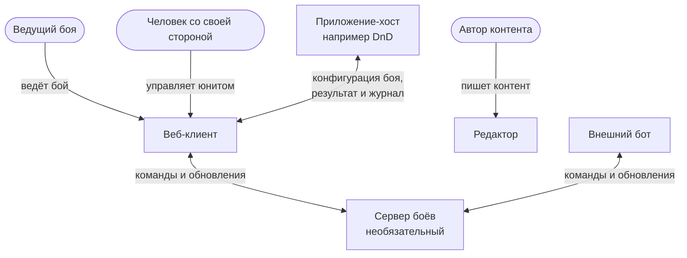

# 2. Окружение системы

Кто и что работает с системой и по каким каналам.

Обновлено 5 октября 2026.

Система состоит из веб-клиента, редактора и необязательного сервера боёв. С ней работают люди, которые ведут бой или управляют своими сторонами, авторы контента, внешние боты и приложения-хосты. С хостом клиент обменивается сообщениями `postMessage` через iframe, а с сервером — через WebSocket.

## 2.1 Схема

Овал на схеме — человек, прямоугольник — программа. Веб-клиент, редактор и сервер боёв — наша система, остальное снаружи. На стрелке подписано, что передаётся.

## 2.2 Кто работает с системой

| Кто | Что делает | Через что |
|---|---|---|
| Ведущий боя | Без сервера ходит за все стороны и показывает экран остальным. С сервером наблюдает и вмешивается, когда нужно. В DnD это мастер | Веб-клиент |
| Человек со своей стороной | Управляет своим юнитом или стороной со своего устройства. Без сервера смотрит экран ведущего. В DnD это игрок | Веб-клиент, если есть сервер |
| Автор контента | Пишет паки и сценарии | Редактор |
| Приложение-хост | Показывает бой у себя, передаёт параметры юнитов и права акторов, забирает результат | iframe и `postMessage`; если есть сервер, ещё и HTTP API |
| Внешний бот | Действует от имени одного из акторов | Канал к серверу; протокол тот же, что у клиентов |

## 2.3 Внешние интерфейсы

| Интерфейс | Между кем | Что передаётся | Где описан |
|---|---|---|---|
| Протокол встраивания | Хост и веб-клиент | Создание боя, сигнал готовности, прогресс боя, результат, журнал | [Встраивание](concepts/host-integration.md), [справочник](../reference/protocol.md) |
| Протокол боя | Клиенты и боты с сервером | Команды, ответы на них, пакеты событий, проекции, догрузка пропущенного | [Синхронизация](concepts/arbiter-and-sync.md), [справочник](../reference/protocol.md) |
| HTTP API сервера | Хост с сервером | Создание сетевого боя, ссылки для акторов, результат, журнал | [Встраивание](concepts/host-integration.md) |
| Формат паков и сценариев | Авторы и движок | JSON по опубликованным схемам | [Контент](concepts/content.md) |

## 2.4 Что остаётся снаружи

Кампания, персонажи и сюжет живут у хоста. Мы получаем от него только то, что нужно для боя, и возвращаем результат.

Экран ведущего остальным показывают сторонними средствами: видеозвонком или проектором.

Учётные записи и вход пользователей тоже на стороне хоста. Сервер боёв выдаёт только токены акторов для конкретного боя.
