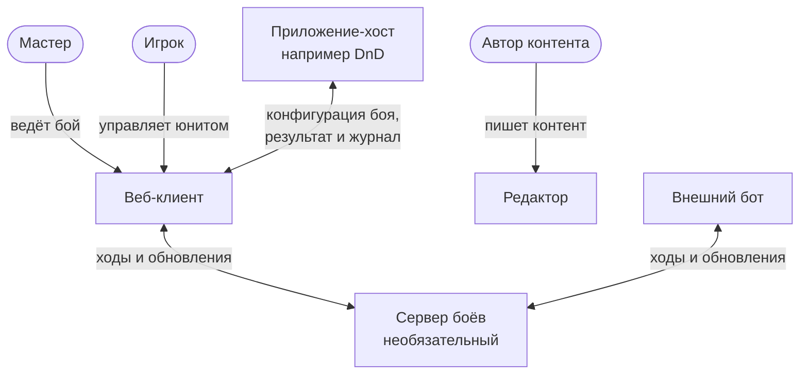

# 2. Контекст

Обновлено: 2026-10-03.

Кратко: система — это веб-клиент и необязательный сервер боёв. С ней работают мастер, игроки, внешние боты и приложения-хосты. С хостом клиент общается сообщениями postMessage через iframe, с сервером — через WebSocket.

## 2.1 Схема контекста

Как читать: овал — человек, прямоугольник — программа. Веб-клиент, редактор и сервер боёв — наша система, остальное — внешние участники. Подпись на стрелке — что передаётся.

## 2.2 Внешние участники

| Участник | Что делает | Как связан с системой |
|---|---|---|
| Мастер | Ведёт бой. В режиме без сервера ходит за все стороны и транслирует экран игрокам. С сервером наблюдает и вмешивается | Веб-клиент |
| Игрок | Управляет своим юнитом или стороной. Без сервера смотрит трансляцию экрана мастера | Веб-клиент на своём устройстве, только если есть сервер |
| Автор контента | Пишет паки и сценарии | Редактор |
| Приложение-хост | Встраивает бой в свой интерфейс, передаёт параметры, забирает результат | iframe и postMessage; при наличии сервера также HTTP API |
| Внешний бот | Программа, которая играет за место | Канал к серверу, тот же протокол, что у клиентов |

## 2.3 Внешние интерфейсы

| Интерфейс | Между кем | Что передаётся | Где описан |
|---|---|---|---|
| Протокол встраивания | Хост и веб-клиент | Создание боя, готовность, ход боя, результат, журнал | [concepts/host-integration.md](concepts/host-integration.md), [reference/protocol.md](../reference/protocol.md) |
| Протокол боя | Клиенты и боты с сервером | Команды, ответы, пакеты событий, срезы, переподключение | [concepts/authority-and-sync.md](concepts/authority-and-sync.md), [reference/protocol.md](../reference/protocol.md) |
| HTTP API сервера | Хост с сервером | Создание сетевого боя, ссылки для участников, результат, журнал | [concepts/host-integration.md](concepts/host-integration.md) |
| Формат паков и сценариев | Авторы контента и движок | JSON по опубликованным схемам | [concepts/content.md](concepts/content.md) |

## 2.4 Что вне системы

- Глобальная кампания, персонажи, сюжет — у хоста. Мы получаем только параметры для боя и возвращаем результат.
- Трансляция экрана мастера игрокам — внешними средствами (видеозвонок, проектор).
- Учётные записи и авторизация пользователей хоста — у хоста. Сервер боёв выдаёт только токены мест для конкретного боя.
