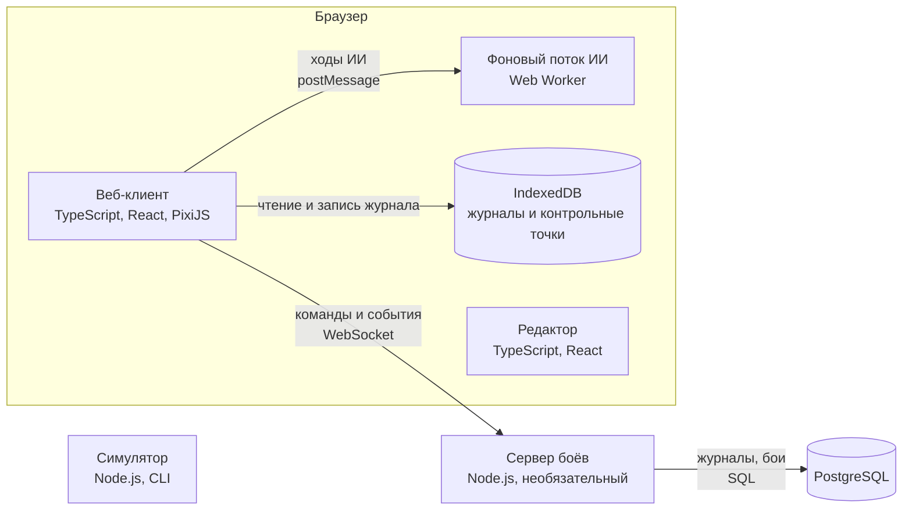

# 4. Строительные блоки

Обновлено: 2026-10-03.

Кратко: система состоит из четырёх приложений (веб-клиент, сервер, редактор, симулятор), собранных из общих пакетов. В центре ядро и прикладной слой. Они объявляют порты, адаптеры их реализуют, а приложения в точке сборки выбирают нужные адаптеры по профилю. Новое поведение добавляется новым адаптером или расширением, без правок центра.

## 4.1 Приложения (уровень контейнеров C4)



Легенда: прямоугольники — запускаемые приложения, цилиндры — хранилища. Подпись на стрелке — что передаётся и как.

| Приложение | Ответственность | Чего не делает |
|---|---|---|
| Веб-клиент (`apps/web`) | Проводит бой локально или подключается к серверу. Показывает бой, принимает ввод, хранит журнал, общается с хостом | Не хранит данные кампании хоста |
| Сервер боёв (`apps/server`) | Источник истины для сетевых боёв. Хранит бои и журналы, рассылает срезы участникам, запускает серверных ботов | Не рисует и не нужен для локальной игры |
| Редактор (`apps/editor`) | Создание и проверка паков и сценариев, тестовый запуск боя | Не участвует в боях хостов |
| Симулятор (`apps/sim`) | Тысячи боёв ИИ против ИИ без интерфейса для проверки баланса и детерминизма | Не работает в браузере |

## 4.2 Пакеты

```text
packages/
  hex/            геометрия гексов, поиск пути, досягаемость
  kernel/         ядро: состояние, команды, события, шаги, запросы решений, контракты расширений
  rules-stdlib/   стандартные расширения: операции, условия, планировщики ходов, наборы правил
  content/        загрузка паков, слияние, миграции, проверка
  protocol/       опубликованный язык: схемы конфигурации, результата, команд, событий, журнала, сообщений
  application/    сессия боя, источник истины, реплика, срезы, история, порты
  presentation/   проигрыватель событий, отображаемое состояние, порт отрисовщика
  ui-react/       интерфейс боя
  editor-core/    модель редактора
adapters/
  storage-indexeddb/  storage-memory/  storage-postgres/
  channel-memory/  channel-websocket/  channel-broadcast/
  authority-local/  authority-remote/
  agent-ui/  agent-utility/  agent-mcts/  agent-llm/  agent-remote/
  renderer-pixi/  renderer-svg/  renderer-headless/
  host-postmessage/  host-standalone/
  content-static/  content-http/
apps/
  web/  server/  editor/  sim/
packs/
  core/  demo-homm/  demo-d20/
```

| Пакет | Ответственность | Зависит от |
|---|---|---|
| `hex` | Координаты, соседи, линия видимости, поиск пути, досягаемость | ничего |
| `kernel` | Чистые функции боя: проверить команду и выдать события, применить событие. Контракты расширений: операция, условие, планировщик, набор правил | `hex` |
| `rules-stdlib` | Стандартные реализации расширений ядра | `kernel` |
| `content` | Загрузка паков, миграции форматов, проверка схемами и по смыслу, реестр контента | `kernel`, `protocol` |
| `protocol` | Схемы и типы всего, что пересекает границы: конфигурация и результат боя, команды, события, журнал, сообщения канала и хоста. Версии формата | `kernel` (только типы) |
| `application` | Сценарии использования: сессия боя, источник истины, реплика, срезы, повтор и откат. Объявляет все порты | `kernel`, `protocol`, `content` |
| `presentation` | Проигрыватель событий, отображаемое состояние, порт отрисовщика, реестр меток анимаций | `protocol`, `application` (типы) |
| `ui-react` | Интерфейс боя на React | `presentation`, `application` |
| `editor-core` | Модель редактора с отменой, проверка сценариев на лету | `content`, `kernel`, `hex` |
| `adapters/*` | По одному пакету на технологию. Реализуют порты | `application`, `presentation`, `protocol` |
| `apps/*` | Точки сборки: выбирают адаптеры, заполняют реестры, запускают | всё |

Правило зависимостей простое: зависимости направлены к центру. Ядро не знает ни о чём снаружи. Прикладной слой знает ядро и протокол. Адаптеры знают прикладной слой. Приложения знают всё, но от них не зависит никто. Полный список правил и их автоматическая проверка — в разделе 4.7.

## 4.3 Порты

Порты объявлены в пакете `application` (порт отрисовщика — в `presentation`). Их два вида: входящие, через которые систему вызывают, и исходящие, через которые система сама обращается наружу. Наброски интерфейсов — в [reference/types.md](../reference/types.md).

### Входящие порты

| Порт | Кто вызывает | Что умеет |
|---|---|---|
| `BattlePlay` | Интерфейс, агенты | Отправить команду, получить срез, подписаться на пакеты событий, запросить подсказки: доступные действия, путь, прогноз |
| `BattleHosting` | Мост хоста, HTTP API сервера | Создать бой из конфигурации, продолжить сохранённый бой, получить результат, выгрузить журнал |
| `BattleHistory` | Интерфейс мастера, просмотр записи | Перейти к шагу журнала, проиграть по шагам, откатить к шагу, начать ответвление с шага |
| `BattleAdmin` | Интерфейс мастера | Пауза, назначить агента месту, правка состояния мастером |

### Исходящие порты

| Порт | Зачем | Адаптеры |
|---|---|---|
| `JournalStore` | Хранить журналы, контрольные точки, результаты | IndexedDB, память, PostgreSQL |
| `Authority` | Принять команду и вернуть пакет событий или отказ | локальный (выполняет ядро на месте), удалённый (через канал к серверу) |
| `Channel` | Двусторонняя доставка сообщений протокола | память, WebSocket, BroadcastChannel (несколько вкладок) |
| `Agent` | Принять решение за место | интерфейс человека, простой ИИ, ИИ с поиском, языковая модель, удалённый участник |
| `HostBridge` | Общаться с хостом: получить конфигурацию, отдать результат и журнал | postMessage, автономный режим (параметры из адреса, скачивание файла) |
| `ContentSource` | Получить паки и сценарии | встроенные в сборку, загрузка по HTTP |
| `Renderer` | Нарисовать поле и проиграть события | PixiJS, SVG, без вывода |
| `Clock` | Время для отметок в журнале и таймеров хода | системное, фиксированное в тестах |
| `Entropy` | Зерно для генератора случайных чисел нового боя | системное, фиксированное в тестах |
| `SeatPolicy` | Кто какими местами управляет и что ему разрешено | локальная (мастер владеет всеми местами), серверная (токены мест) |

Ядро в этой таблице не участвует: оно не обращается наружу вообще. Время и случайность приходят к нему как данные.

## 4.4 Реестры расширений

Реестр — это таблица «идентификатор → реализация». Реестры заполняются в точке сборки и после запуска не меняются.

| Реестр | Что регистрируется | Кто ссылается по идентификатору |
|---|---|---|
| Операции | Урон, лечение, наложение эффекта, призыв и так далее | Контент: эффекты, способности, триггеры |
| Условия | Проверки вроде «соседний гекс», «в зоне видимости» | Контент |
| Планировщики ходов | «По скорости», «по инициативе» | Набор правил |
| Наборы правил | `core:homm-classic`, `core:d20-tactical` | Сценарий, конфигурация боя |
| Миграции событий | Перевод старых версий событий в новые | Чтение журналов |
| Агенты | Виды агентов по названию | Конфигурация боя (кто управляет местом) |
| Каналы | По схеме адреса: `memory:`, `ws:`, `broadcast:` | Профиль, конфигурация подключения |
| Отрисовщики | `pixi`, `svg`, `headless` | Профиль, настройки |
| Метки анимаций | Обработчики меток | Манифест оформления |

## 4.5 Профили

Профиль — готовый набор адаптеров для режима работы. Точка сборки выбирает профиль по адресу страницы, по сообщению хоста или по настройкам окружения.

| Профиль | Источник истины | Хранилище | Каналы | Агенты | Хост и отрисовка |
|---|---|---|---|---|---|
| Один мастер (`solo`) | локальный | IndexedDB | в памяти | интерфейс мастера на всех местах, ИИ в Web Worker | автономный режим, PixiJS |
| Встроенный (`embedded`) | локальный | IndexedDB | в памяти | как в `solo` | postMessage, PixiJS |
| Сетевой клиент (`networked`) | удалённый | IndexedDB как кэш реплики | WebSocket | интерфейс своих мест | postMessage или автономный, PixiJS |
| Сервер (`server`) | локальный, на сервере | PostgreSQL | WebSocket к участникам | серверные ИИ и языковая модель, удалённые участники | нет |
| Симуляция и тесты (`headless`) | локальный | в памяти | в памяти | ИИ, сценарные агенты | без вывода |
| Просмотр записи (`replay`) | нет, только чтение журнала | IndexedDB или файл | нет | нет | PixiJS |

Профили `embedded` и `networked` можно сочетать: хост открывает iframe, а клиент внутри подключается к серверу.

## 4.6 Как добавлять новое

Новые возможности добавляются новым адаптером или расширением и одной строкой в профиле. Ядро и прикладной слой не меняются.

| Что добавляем | Что делаем |
|---|---|
| Сервер | Приложение `apps/server` собирает тот же прикладной слой с адаптерами PostgreSQL и WebSocket. В клиенте профиль `networked` подключает удалённый источник истины. Источник истины с самого начала был портом |
| Новый транспорт, например WebRTC | Новый пакет `adapters/channel-webrtc` реализует `Channel`, проходит общие тесты канала и регистрируется по схеме `rtc:` |
| Новый ИИ | Новый пакет реализует `Agent` и регистрируется под своим названием. Ядро чистое, поэтому ИИ использует его для перебора вариантов |
| Новый отрисовщик | Новый пакет реализует `Renderer`. Срезы и события не меняются |
| Новый хост | Хост общается по опубликованному протоколу встраивания. Перевод данных хоста в конфигурацию боя и обратно делается на стороне хоста |
| Новое хранилище | Новый пакет реализует `JournalStore` и проходит общие тесты хранилища |
| Новая механика в правилах | Новая операция, условие или планировщик в `rules-stdlib` или в отдельном пакете расширений; регистрация в реестре |

Для каждого порта есть общий набор контрактных тестов. Любой адаптер порта обязан их проходить.

## 4.7 Правила зависимостей

1. `kernel` и `hex` не импортируют ничего за своими пределами. В них запрещены DOM, API Node, `Math.random` и `Date.now`.
2. `rules-stdlib` зависит только от `kernel` и `hex`.
3. `protocol` зависит только от типов `kernel`.
4. `content` зависит от `kernel` и `protocol`.
5. `application` зависит от `kernel`, `protocol`, `content`. Никогда от адаптеров, интерфейса и приложений.
6. `presentation` зависит от `protocol` и типов `application`.
7. Адаптер зависит от `application`, `presentation` и `protocol`. Адаптеры не зависят друг от друга.
8. От `apps/*` не зависит никто.
9. Циклов нет.
10. Сборка сервера не содержит React, PixiJS и DOM. Сборка клиента не содержит драйвера PostgreSQL.

Правила проверяются в CI автоматически: dependency-cruiser для направлений и циклов, ESLint для запрещённых глобальных объектов в ядре, проверка состава сборок. Подробнее — ADR [0018](../decisions/0018-dependency-rules-enforced.md).
