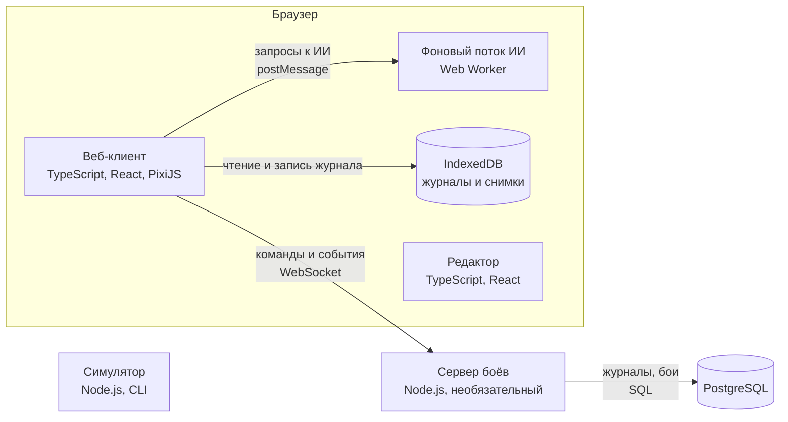

# 4. Строительные блоки

Из каких приложений и пакетов состоит система, как они связаны и как добавлять новое.

Обновлено 5 октября 2026.

Приложений четыре: веб-клиент, сервер, редактор и симулятор. Все они собраны из общих пакетов. В центре лежат ядро и прикладная логика. Порты объявляет прикладная логика, а порты экрана — слой визуализации. У ядра портов нет, только интерфейсы расширений. Адаптеры реализуют эти порты, а каждое приложение при запуске выбирает нужные адаптеры по профилю. Чтобы добавить новую возможность, пишут новый адаптер или расширение, а центр не трогают.

## 4.1 Приложения



Прямоугольник — приложение, цилиндр — хранилище. На стрелке подписано, что передаётся и как.

| Приложение | Что делает | Чего не делает |
|---|---|---|
| Веб-клиент (`apps/web`) | Ведёт бой сам или подключается к серверу. Показывает бой, принимает ввод, хранит журнал, общается с хостом | Не хранит данные кампании хоста |
| Сервер боёв (`apps/server`) | В сетевом бою работает арбитром. Хранит бои и журналы, рассылает акторам проекции, запускает серверных агентов ИИ | Ничего не рисует. Для боя без сети не нужен |
| Редактор (`apps/editor`) | Помогает создавать и проверять паки и сценарии, запускает пробный бой | В боях хостов не участвует |
| Симулятор (`apps/sim`) | Прогоняет тысячи боёв ИИ против ИИ без интерфейса, чтобы проверить баланс и воспроизводимость | В браузере не работает |

## 4.2 Пакеты

```text
packages/
  hex/            гексы: координаты, поиск пути, досягаемость
  kernel/         ядро: состояние, команды, события, шаги, запросы ввода, интерфейсы расширений
  rules-stdlib/   стандартные расширения: операции, условия, порядок ходов, наборы правил
  content/        загрузка паков, слияние, миграции, проверка
  protocol/       схемы всего, что пересекает границы: конфигурация, результат, команды, события, журнал, сообщения
  application/    прикладная логика: сессия боя, арбитр, копия боя, проекции, история, порты
  presentation/   проигрыватель событий, отображаемое состояние, порт рендерера
  ui-react/       интерфейс боя
  editor-core/    логика редактора
adapters/
  storage-indexeddb/  storage-memory/  storage-postgres/
  channel-memory/  channel-websocket/  channel-broadcast/
  arbiter-local/  arbiter-remote/
  access-single/  access-table/  access-server/
  agent-ui/  agent-utility/  agent-mcts/  agent-llm/  agent-remote/
  renderer-pixi/  renderer-svg/  renderer-headless/
  host-postmessage/  host-standalone/
  content-static/  content-http/
  skin-static/  skin-http/
apps/
  web/  server/  editor/  sim/
packs/
  core/  demo-homm/  demo-d20/
```

| Пакет | За что отвечает | От чего зависит |
|---|---|---|
| `hex` | Координаты, соседи, линия видимости, поиск пути, досягаемость | Ни от чего |
| `kernel` | Две главные функции: проверить команду и выдать события, применить событие к состоянию. Плюс интерфейсы расширений: операций, условий, порядка ходов и других вариантов механик | `hex` |
| `rules-stdlib` | Стандартные реализации расширений ядра | `kernel` |
| `content` | Загрузка паков, миграции форматов, проверка по схемам и по смыслу, реестр контента | `kernel`, `protocol` |
| `protocol` | Схемы и типы всего, что передаётся между частями системы, и версии форматов | Только типы `kernel` |
| `application` | Сессия боя, арбитр, копия боя, проекции, просмотр и откат. Здесь объявлены все порты. Акторов знает только по идентификаторам | `kernel`, `protocol`, `content` |
| `presentation` | Проигрыватель событий, отображаемое состояние, манифест оформления, порт рендерера | `protocol`, типы `application` |
| `ui-react` | Интерфейс боя на React | `presentation`, `application` |
| `editor-core` | Логика редактора с отменой правок и проверкой сценария на лету | `content`, `kernel`, `hex` |
| `adapters/*` | По пакету на технологию, каждый реализует порт | `application`, `presentation`, `protocol` |
| `apps/*` | Точки сборки: выбирают адаптеры, заполняют реестры, запускают приложение | Всё |

Зависимости всегда направлены к центру. Ядро не знает ничего снаружи. Прикладная логика знает ядро и протокол. Адаптеры знают прикладную логику. Приложения знают всё, но от них не зависит никто. Полный список правил и то, как мы их проверяем, — в разделе 4.7.

## 4.3 Порты

Порты объявлены в пакете `application`, а порты рендерера и манифеста оформления — в `presentation`. Через входящие порты систему вызывают снаружи. Через исходящие система сама обращается к внешнему миру. Наброски интерфейсов лежат в [справочнике](../reference/types.md).

### Входящие порты

| Порт | Кто вызывает | Что умеет |
|---|---|---|
| `BattlePlay` | Интерфейс, агенты | Принять команду, вернуть проекцию, подписать на пакеты событий, подсказать доступные действия, путь и прогноз. Подсказки уже отфильтрованы политикой доступа |
| `BattleHosting` | Мост к хосту, HTTP API сервера | Создать бой по конфигурации, продолжить сохранённый бой, вернуть результат, выгрузить журнал |
| `BattleHistory` | Интерфейс, просмотр записи | Показать состояние после любой записи журнала, отдать записи для пошагового просмотра, начать ответвление |

### Исходящие порты

| Порт | Зачем нужен | Адаптеры |
|---|---|---|
| `JournalStore` | Хранить журналы, снимки и результаты | IndexedDB, память, PostgreSQL |
| `Arbiter` | Принять команду актора и вернуть пакет событий или отказ | Локальный, который считает ядром на месте; удалённый, который передаёт команду серверу |
| `Channel` | Передавать сообщения протокола в обе стороны | Память, WebSocket, BroadcastChannel для нескольких вкладок |
| `AccessPolicy` | Решить, можно ли актору отправить команду, какие стороны он видит, кто действует в текущий ход и кому отдать запрос ввода | «Один актор может всё», «по таблице прав» из конфигурации боя, серверная с проверкой токенов |
| `Agent` | Принять решение от имени актора | Интерфейс человека, простой ИИ, ИИ с перебором, языковая модель, внешний бот через канал |
| `HostBridge` | Получить от хоста конфигурацию, отдать ему результат и журнал | `postMessage`; автономный режим, где параметры берутся из адреса страницы, а журнал скачивается файлом |
| `ContentSource` | Загрузить паки и сценарии | Встроенные в сборку, загрузка по HTTP |
| `Renderer` | Нарисовать поле и проиграть события | PixiJS, SVG, пустой рендерер для тестов |
| `SkinSource` | Загрузить манифест оформления, картинки и звуки | Встроенные в сборку, загрузка по HTTP |
| `Clock` | Дать время для отметок в журнале и для ограничения времени на ответ агента | Системное время, в тестах фиксированное |
| `Entropy` | Дать зерно генератора случайных чисел для нового боя | Системное, в тестах фиксированное |

Ядра в этой таблице нет: наружу оно не обращается совсем. Времени ядро не знает, а случайные числа берёт из генератора в своём состоянии. Зерно генератора при создании боя даёт порт `Entropy`.

## 4.4 Реестры расширений

Реестр — это таблица «имя — реализация». Точка сборки заполняет реестры при запуске, и дальше они не меняются.

| Реестр | Что в нём | Кто ссылается по имени |
|---|---|---|
| Операции | Урон, лечение, наложение эффекта, призыв и другие | Эффекты, способности и триггеры в контенте |
| Условия | Проверки вроде «соседний гекс» или «в зоне видимости» | Контент |
| Порядок ходов | По скорости, по инициативе, стороны по очереди | Наборы правил |
| Варианты механик | Расчёт атаки, этапы урона и другие механики, на которые ссылается набор правил | Наборы правил в паках |
| Миграции событий | Перевод старых версий событий в новые | Чтение журналов |
| Агенты | Виды агентов, в том числе запасной агент | Конфигурация боя, где указано, какой агент действует от имени актора |
| Политики доступа | Политики и готовые наборы прав | Профиль, конфигурация боя |
| Каналы | Каналы по схеме адреса: `memory:`, `ws:`, `broadcast:` | Профиль, настройки подключения |
| Рендереры | `pixi`, `svg`, `headless` | Профиль, настройки |
| Обработчики анимаций | Код, который проигрывает анимацию определённого вида | Манифест оформления |

## 4.5 Профили

Профиль — это готовый набор адаптеров для одного режима работы. Точка сборки выбирает профиль по адресу страницы, по сообщению от хоста или по настройкам окружения.

| Профиль | Арбитр | Политика доступа | Хранилище | Каналы | Агенты | Хост и экран |
|---|---|---|---|---|---|---|
| Одно устройство (`solo`) | Локальный | Один актор может всё | IndexedDB | В памяти | Интерфейс для одного актора, ИИ в Web Worker | Автономный режим, PixiJS |
| Встроенный бой (`embedded`) | Локальный | Из конфигурации хоста | IndexedDB | В памяти | Как в `solo` | `postMessage`, PixiJS |
| Сетевой клиент (`networked`) | Удалённый | Проверяет сервер | IndexedDB как кэш копии боя | WebSocket | Интерфейс для своего актора | `postMessage` или автономный режим, PixiJS |
| Сервер (`server`) | Локальный, но на сервере | Серверная, по токенам | PostgreSQL | WebSocket к акторам | Серверный ИИ и языковая модель | Нет |
| Тесты и симуляции (`headless`) | Локальный | Любая, по тесту | В памяти | В памяти | ИИ, агенты по сценарию теста | Пустой рендерер |
| Просмотр записи (`replay`) | Нет, журнал только читается | Нет | IndexedDB или файл | Нет | Нет | PixiJS |

Профили `embedded` и `networked` можно совместить: хост открывает iframe, а клиент внутри него подключается к серверу.

## 4.6 Как добавить новое

Новая возможность — это новый адаптер или расширение и одна строка в профиле. Ядро и прикладная логика не меняются.

| Что добавляем | Что делаем |
|---|---|
| Сервер | Приложение `apps/server` собирает ту же прикладную логику с адаптерами PostgreSQL и WebSocket. В клиенте профиль `networked` подключает удалённого арбитра. Арбитр с самого начала был портом, поэтому клиент не переделываем |
| Новый транспорт, например WebRTC | Пишем пакет `adapters/channel-webrtc` с реализацией порта `Channel`. Он проходит общие тесты канала и регистрируется по схеме `rtc:` |
| Новый ИИ | Пишем пакет с реализацией порта `Agent` и регистрируем его под своим именем. Ядро без побочных эффектов, поэтому ИИ перебирает через него варианты действий |
| Новый рендерер | Пишем пакет с реализацией порта `Renderer`. Проекции и события остаются прежними |
| Новый хост | Хост говорит с нами по опубликованному протоколу встраивания. Свои данные в нашу конфигурацию боя и обратно он переводит сам |
| Новая роль или схема прав | Описываем новый набор прав в конфигурации боя. Если таблицы прав мало, пишем новую политику доступа с реализацией порта `AccessPolicy` |
| Новое хранилище | Пишем пакет с реализацией порта `JournalStore`. Он проходит общие тесты хранилища |
| Новая механика | Добавляем операцию, условие или порядок ходов в `rules-stdlib` или отдельный пакет и регистрируем в реестре |

У каждого порта есть общий набор тестов, который должен пройти любой его адаптер.

## 4.7 Правила зависимостей

1. `kernel` и `hex` ничего не импортируют снаружи. В них запрещены DOM, API Node.js, `Math.random` и `Date.now`. В `kernel` нет понятий актора, прав и ролей.
2. `rules-stdlib` зависит только от `kernel` и `hex`.
3. `protocol` берёт из `kernel` только типы.
4. `content` зависит от `kernel` и `protocol`.
5. `application` зависит от `kernel`, `protocol` и `content`, но никогда от адаптеров, интерфейса и приложений.
6. `presentation` зависит от `protocol` и типов `application`.
7. Адаптер зависит от `application`, `presentation` и `protocol`. Друг от друга адаптеры не зависят.
8. От `apps/*` не зависит никто.
9. Циклов нет.
10. В сборке сервера нет React, PixiJS и DOM. В сборке клиента нет драйвера PostgreSQL.

CI проверяет эти правила автоматически: направления и циклы — dependency-cruiser, запрещённые глобальные объекты в ядре — ESLint, состав сборок — отдельная проверка. Подробнее в ADR [0001](../decisions/0001-ports-adapters-microkernel.md).
