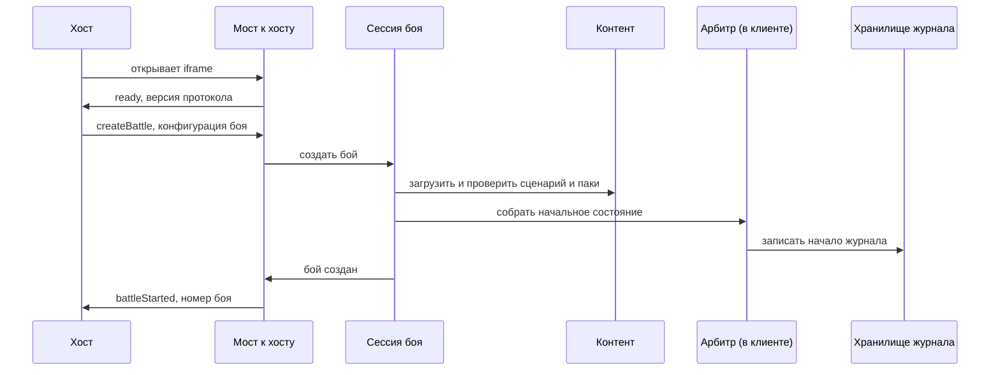
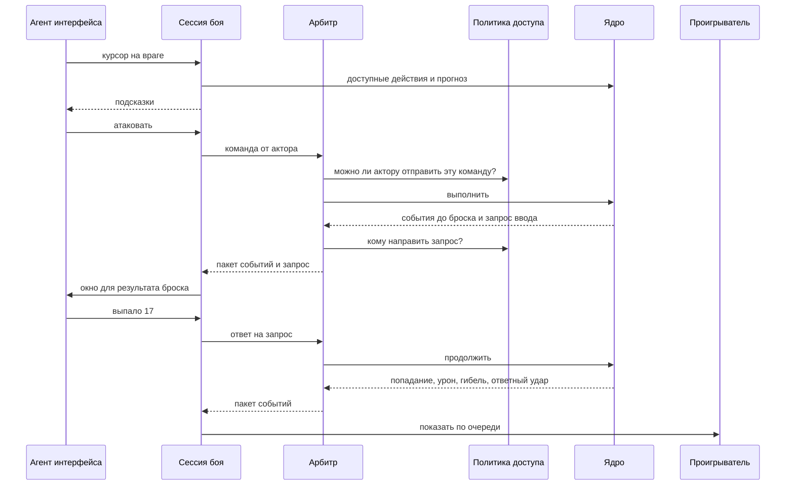
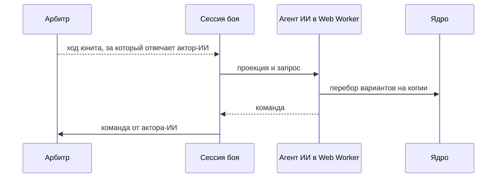
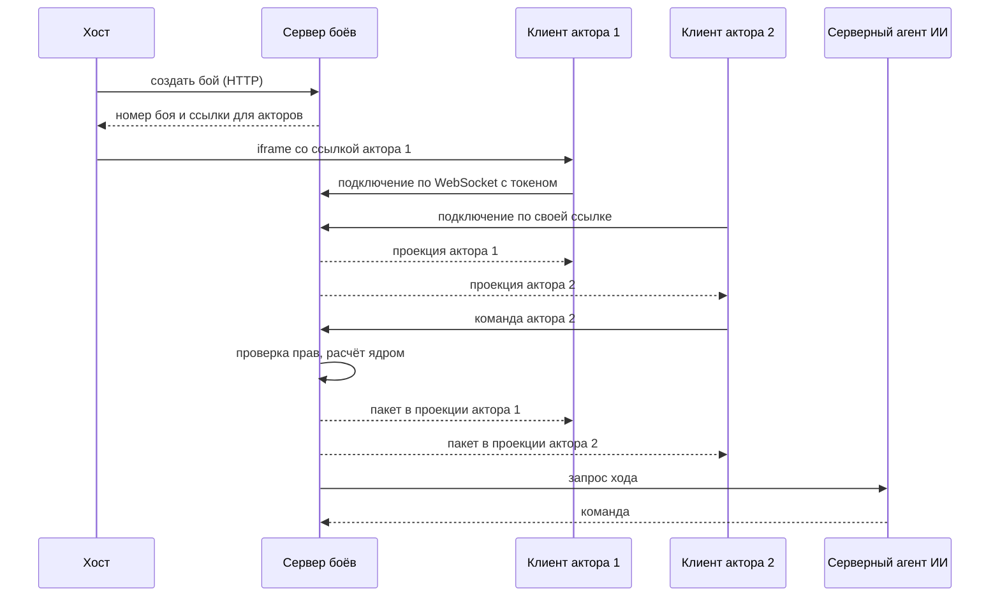
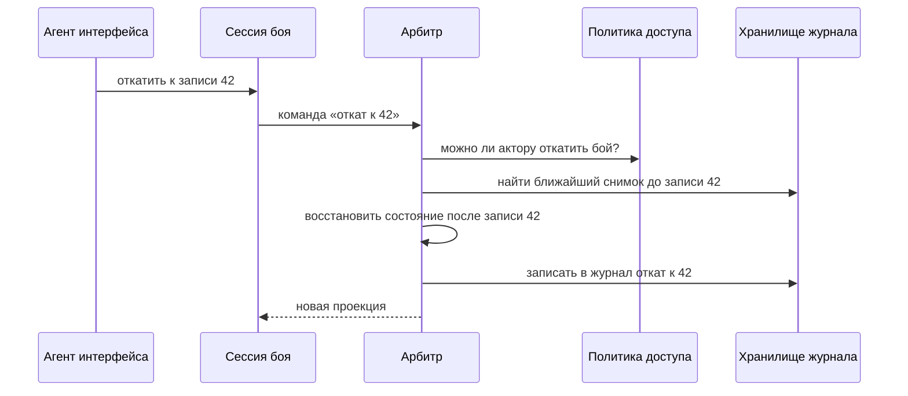

# 5. Сценарии работы

Как части системы работают вместе в семи типичных ситуациях.

Обновлено 5 октября 2026.

Во всех сценариях используются одни и те же порты, меняются только адаптеры. Бой на одном устройстве и сетевой бой отличаются тем, где работает арбитр и какая подключена политика доступа, а не логикой. Ядро ни в одном сценарии не знает, кто отправил команду.

## 5.1 Хост запускает бой без сервера

Хост открывает наш клиент внутри iframe и присылает конфигурацию боя. Сервер в этом не участвует.

1. Хост открывает iframe по адресу встраивания, и клиент запускается в профиле `embedded`.
2. Мост к хосту проверяет, что страница-родитель есть в списке разрешённых, и отправляет `ready` с версией протокола.
3. Хост присылает `createBattle`. В нём номер нашего сценария, параметры юнитов (например, сколько здоровья у персонажа осталось после прошлого боя), список акторов с их правами и агентами, а также настройки.
4. Сессия загружает сценарий и паки и проверяет конфигурацию. Если что-то не так, хост получает список ошибок, и бой не создаётся.
5. Арбитр строит начальное состояние: берёт юниты из сценария и накладывает на них параметры. Политику доступа сессия создала заранее по профилю и таблице прав из конфигурации, а арбитр только обращается к ней.
6. В хранилище попадает начало журнала: паки с версиями, хеш контента, конфигурация, зерно генератора случайных чисел.
7. Хост получает `battleStarted` с номером боя. Если страница перезагрузится, бой продолжится из хранилища по этому номеру.

## 5.2 Бросок вводится вручную

Один актор ведёт бой за все стороны, а броски атаки по набору правил вводятся извне. Например, человек бросает настоящие кубики.

1. Пока человек водит курсором, интерфейс спрашивает подсказки у сессии через порт `BattlePlay`. Сессия считает их ядром, а интерфейс сам решает, как подсветить варианты. Состояние боя при этом не меняется.
2. Человек выбирает атаку, и агент интерфейса отправляет команду от имени своего актора.
3. Арбитр спрашивает политику доступа, можно ли этому актору отправить команду этому юниту. Политика «один актор может всё» отвечает «можно».
4. Ядро проверяет, что атака допустима по правилам, и раскладывает её на шаги: подойти, ударить, получить ответный удар, проверить погибших, закончить ход юнита.
5. Ядро доходит до броска атаки. По набору правил этот бросок приходит извне, поэтому ядро записывает запрос ввода и останавливается.
6. Арбитр записывает пакет в журнал и спрашивает политику, кому отдать запрос. Политика называет того же актора, и у него открывается окно ввода. Человек вводит 17.
7. Ответ приходит обычной командой, и ядро продолжает с того же шага: попадание, урон, гибель части отряда, ответный удар. Бросок для ответного удара по набору правил берётся из генератора, поэтому ядро бросает его само, без запроса.
8. Проигрыватель показывает события по очереди, и экран догоняет настоящее состояние по мере показа.

## 5.3 Ходит ИИ

1. После очередного пакета арбитр определяет, чей ход. По политике доступа этим юнитом ходит актор, за которым стоит агент ИИ.
2. Сессия отправляет агенту проекцию в пределах области видимости его актора. То, что от неё скрыто, агент не получает.
3. Агент работает в Web Worker, чтобы интерфейс не подтормаживал. Он перебирает варианты, вызывая ядро на копии проекции.
4. Агент возвращает команду, и она проходит ту же проверку, что и любая другая.
5. Если агент не уложился в отведённое время или упал, за него отвечает запасной агент: он выбирает один из допустимых вариантов по своим правилам. Ядро в этом не участвует.

## 5.4 Сетевой бой

Акторы работают со своих устройств, а арбитр — на сервере.

1. Хост создаёт бой через HTTP API сервера, передаёт таблицу прав и получает по ссылке на каждого актора. В ссылке зашит токен актора.
2. Каждый открывает свою ссылку. Клиент запускается в профиле `networked` и подключается к серверу по WebSocket.
3. Сервер отправляет каждому актору проекцию в пределах его области видимости. Актору с полной видимостью достаётся весь бой.
4. Актор отправляет команду. Сервер подтверждает актора по токену, сверяет номер версии состояния, спрашивает политику доступа, выполняет команду ядром и записывает пакет в журнал.
5. Сервер рассылает пакет всем, причём каждому в его проекции.
6. Если дальше ходит юнит, за который отвечает серверный агент ИИ, сервер сам его спрашивает. Внешний бот подключается так же, как обычный клиент.
7. Клиенты только применяют полученные события и правила заново не считают. Поэтому генератор случайных чисел и скрытая часть состояния остаются на сервере.

## 5.5 Связь пропала и вернулась

1. Клиент теряет связь. Канал переходит в состояние переподключения, и интерфейс это показывает.
2. Когда связь возвращается, клиент сообщает номер последнего полученного пакета.
3. Сервер присылает недостающие пакеты. Если их слишком много или они уже вошли в снимок, сервер присылает свежую проекцию.
4. Проигрыватель применяет проекцию, восстанавливает из состояния постоянные элементы вроде аур и иконок эффектов и показывает только новые события.
5. Если клиент отправил команду, а ответ потерялся, он отправляет её ещё раз с тем же идентификатором и получает тот же ответ.

## 5.6 Просмотр и откат

1. Актор открывает историю боя и выбирает запись журнала. В режиме просмотра журнал можно листать вперёд и назад. Состояние после каждой записи собирается из ближайшего снимка и последующих событий, а правила заново не считаются. Просмотр ничего не меняет, поэтому арбитр в нём не участвует. В сетевом бою нужные записи клиент запрашивает у сервера через порт `BattleHistory`.
2. Чтобы продолжить бой с выбранной записи, актор отправляет команду сессии «откат».
3. Арбитр спрашивает политику доступа, можно ли этому актору откатить бой. Откат меняет историю для всех, поэтому обычно его разрешают только актору с полными правами.
4. Арбитр восстанавливает состояние после выбранной записи и записывает откат в журнал. Записи после неё не удаляются: они остаются в журнале отменённой веткой, и их можно посмотреть.
5. Вместе с состоянием восстанавливается генератор случайных чисел. Поэтому те же действия после отката дадут те же броски.
6. Все копии боя получают новую проекцию.

## 5.7 Бой заканчивается

1. Ядро проверяет условия победы и поражения после проверки погибших в каждой команде и в начале каждого раунда. Когда одно из них выполнено, ядро выпускает событие о конце боя с исходом и хешем состояния.
2. Арбитр собирает результат боя: исход, что стало с каждым юнитом, потери, сколько потрачено предметов и способностей, значения переменных сценария.
3. Результат и полный журнал сохраняются в хранилище.
4. Мост отправляет хосту `battleFinished` с результатом. Журнал может быть большим, поэтому хост запрашивает его отдельно.
5. В сетевом бою результат и журнал можно получить и через HTTP API сервера.
6. Что делать с результатом, хост решает сам.
