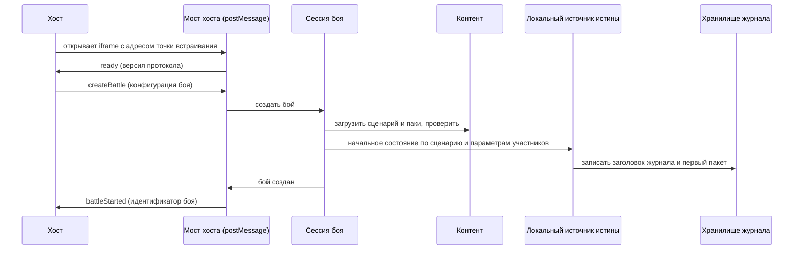
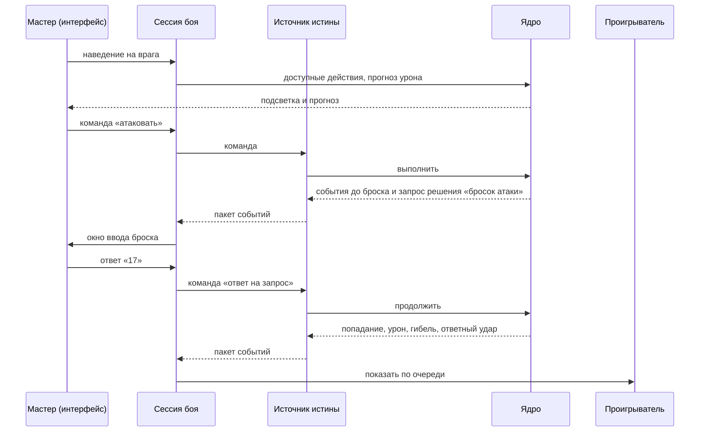
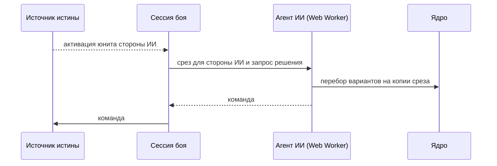
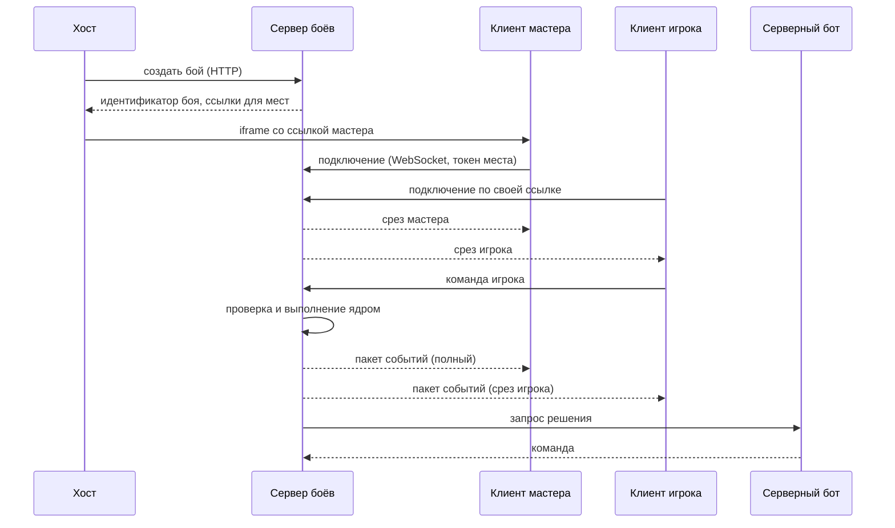
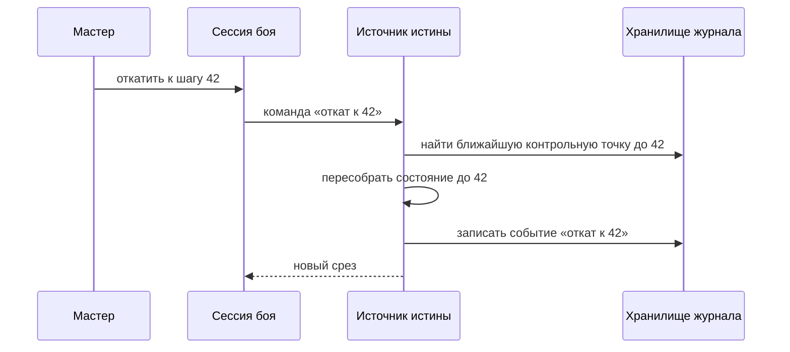

# 5. Сценарии работы

Обновлено: 2026-10-03.

Кратко: семь сценариев показывают, как части системы работают вместе: запуск встроенного боя, ход с ручным броском, ход ИИ, сетевой бой, переподключение, откат и повтор, завершение боя. Во всех сценариях одни и те же порты; меняются только адаптеры.

## 5.1 Запуск встроенного боя без сервера

Хост открывает наш клиент в iframe и передаёт конфигурацию боя. Сервер не участвует.

1. Хост открывает iframe по адресу точки встраивания. Клиент запускается в профиле `embedded`.
2. Мост хоста проверяет, что родительская страница входит в список разрешённых, и отправляет `ready` с версией протокола.
3. Хост отправляет `createBattle`: идентификатор нашего сценария, параметры участников (например, текущее здоровье после прошлого боя), кто из мест игрок, а кто бот, настройки.
4. Сессия загружает сценарий и паки, проверяет конфигурацию. При ошибке хост получает список ошибок, и бой не создаётся.
5. Локальный источник истины строит начальное состояние: юниты из сценария, поверх них параметры участников.
6. В хранилище записывается заголовок журнала: паки и их версии, хеш контента, конфигурация, зерно генератора.
7. Хост получает `battleStarted` с идентификатором боя. Если страницу перезагрузить, бой продолжится из хранилища по этому идентификатору.

## 5.2 Ход с ручным броском мастера

Мастер ведёт бой за все стороны и бросает атакующие кубики физически.

1. Интерфейс спрашивает у ядра доступные действия и прогноз урона и подсвечивает их. Состояние не меняется.
2. Мастер выбирает атаку. Агент интерфейса отправляет команду источнику истины.
3. Ядро проверяет, что действие входит в список доступных, и раскладывает его на шаги: подойти, атаковать, ответный удар, проверить погибших, закончить активацию.
4. Ядро доходит до броска атаки. Набор правил говорит, что этот бросок вводит мастер. Ядро записывает запрос решения и останавливается.
5. Источник истины записывает пакет в журнал. Мастер видит окно ввода и вводит 17.
6. Ответ приходит обычной командой. Ядро продолжает с того же шага: попадание, урон, гибель части отряда, ответный удар. Бросок ответного удара цифровой, его делает источник истины из генератора в состоянии.
7. Проигрыватель показывает события по очереди. Отображаемое состояние догоняет истинное по мере показа.

## 5.3 Ход ИИ

1. После очередного пакета источник истины определяет, чей ход. Ход принадлежит месту, которым управляет ИИ.
2. Сессия отправляет агенту ИИ срез для его стороны. Скрытое от этой стороны агент не получает.
3. Агент работает в Web Worker, чтобы не тормозить интерфейс. Он перебирает варианты, вызывая чистое ядро на копии среза.
4. Агент возвращает команду. Она проходит ту же проверку, что и команда человека.
5. Если агент не ответил за отведённое время или упал, применяется решение по умолчанию: для активации — оборона.

## 5.4 Сетевой бой

Игроки, мастер и боты сидят на своих устройствах. Источник истины — сервер.

1. Хост создаёт бой через HTTP API сервера и получает ссылки для каждого места. В ссылке токен места.
2. Каждый участник открывает свою ссылку. Клиент запускается в профиле `networked` и подключается к серверу по WebSocket.
3. Сервер отправляет каждому срез: мастер видит всё, игрок — своё.
4. Игрок отправляет команду. Сервер проверяет права места, номер версии состояния и саму команду, выполняет её ядром и записывает пакет в журнал.
5. Сервер рассылает пакет всем, для каждого — свой срез событий.
6. Если ход за серверным ботом, сервер сам спрашивает его агента. Внешний бот подключается так же, как клиент игрока.
7. Клиенты только применяют полученные события. Они не выполняют правила заново, поэтому генератор случайных чисел и скрытое состояние остаются на сервере.

## 5.5 Переподключение

1. Клиент теряет связь. Канал сообщает о переподключении, интерфейс показывает это.
2. После восстановления клиент отправляет номер последнего полученного пакета.
3. Сервер присылает недостающие пакеты. Если их слишком много или они уже свёрнуты в контрольную точку, присылает свежий срез.
4. Проигрыватель применяет срез, восстанавливает постоянные эффекты (ауры, иконки статусов) из состояния и показывает только новые события.
5. Если клиент отправил команду, а ответ не дошёл, он отправляет её повторно с тем же идентификатором и получает тот же ответ.

## 5.6 Откат и повтор по шагам

1. Мастер открывает историю боя и выбирает шаг. В режиме просмотра можно двигаться по журналу вперёд и назад: состояние на каждом шаге собирается из ближайшей контрольной точки и последующих событий, правила при этом не вызываются.
2. Чтобы продолжить игру с выбранного шага, мастер выполняет откат. Это обычная команда к источнику истины.
3. Источник истины пересобирает состояние до выбранного шага и записывает в журнал событие «откат». Шаги после отката не удаляются: они остаются в журнале как отменённая ветка и доступны для просмотра.
4. Генератор случайных чисел восстанавливается вместе с состоянием. Поэтому те же действия после отката дадут те же цифровые броски.
5. В сетевом бою откатывать может только мастер. Все реплики получают новый срез.

## 5.7 Завершение боя

1. После очередного шага ядро проверяет условия победы и поражения. Когда условие выполнено, выпускается событие «бой окончен» с исходом и хешем состояния.
2. Источник истины строит результат боя: исход, итоговое состояние каждого юнита, потери, расход предметов и способностей, значения переменных сценария.
3. Результат и полный журнал сохраняются в хранилище.
4. Мост хоста отправляет хосту `battleFinished` с результатом. Журнал хост может запросить отдельно, он бывает большим.
5. В сетевом бою результат и журнал также доступны через HTTP API сервера.
6. Хост сам решает, как изменить своё состояние по результату.
