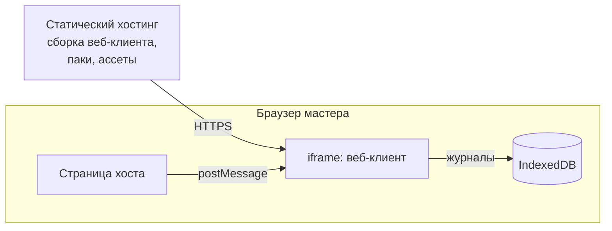
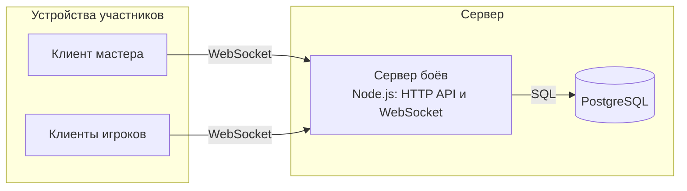

# 6. Развёртывание

Обновлено: 2026-10-03.

Кратко: минимальная поставка — статические файлы веб-клиента. Сервер боёв нужен только для сетевой игры и разворачивается отдельно как один процесс Node.js с PostgreSQL.

## 6.1 Без сервера

- Веб-клиент — набор статических файлов. Паки контента и ассеты лежат рядом или загружаются отдельно.
- Всё состояние боя хранится в IndexedDB на устройстве мастера.
- Хост встраивает клиент через iframe. Наш хостинг отдаёт заголовок `Content-Security-Policy: frame-ancestors` со списком разрешённых хостов.

## 6.2 С сервером

- Сервер боёв — один процесс: HTTP API для хостов, WebSocket для участников, серверные боты.
- В PostgreSQL хранятся бои, журналы, контрольные точки, результаты, привязки мест.
- Масштабирование при необходимости — несколько процессов с распределением боёв по идентификатору. Один бой всегда обслуживает один процесс.
- Конкретное облако не выбрано. Код не зависит от облака.

## 6.3 Окружения

| Окружение | Состав |
|---|---|
| Разработка | Vite dev server для клиента и редактора; сервер и PostgreSQL локально по желанию |
| Тесты в CI | Node.js: ядро, контрактные тесты адаптеров, повтор эталонных журналов, симуляции |
| Продакшен | Статический хостинг для клиента и редактора; сервер боёв и PostgreSQL — когда появится сетевая игра |
