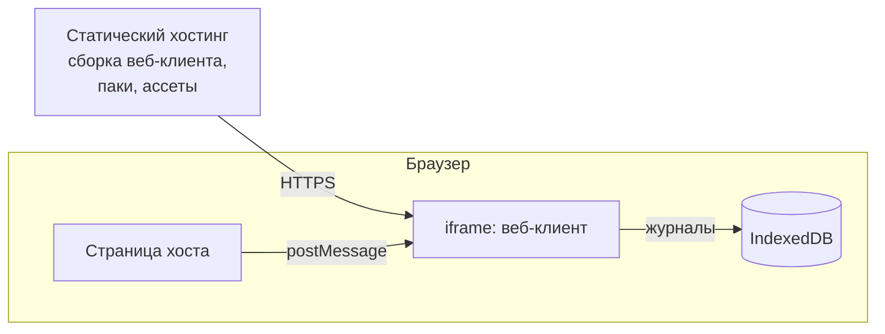
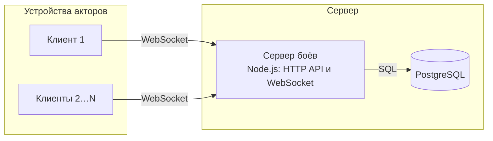

# 6. Развёртывание

Где и как работает система с сервером и без него.

Обновлено 5 октября 2026.

Чтобы играть без сервера, достаточно выложить статические файлы веб-клиента. Сервер боёв нужен только для сетевой игры. Это одно приложение на Node.js с базой PostgreSQL, и разворачивается оно отдельно.

## 6.1 Без сервера

Веб-клиент — это набор статических файлов. Паки контента и ассеты лежат рядом с ним или загружаются отдельно. Всё, что относится к бою, хранится в IndexedDB на этом устройстве.

Хост открывает клиент в iframe. Наш хостинг отдаёт заголовок `Content-Security-Policy: frame-ancestors` со списком хостов, которым это разрешено.

## 6.2 С сервером

Сервер боёв — один процесс. Он отвечает хостам по HTTP, держит соединения WebSocket с акторами и запускает серверных агентов ИИ. В PostgreSQL лежат бои, журналы, снимки, результаты и таблицы прав.

Если одного процесса станет мало, запустим несколько и распределим бои между ними по номеру боя. Один бой всегда обслуживает один процесс.

Облако пока не выбрано, и код от облака не зависит.

## 6.3 Окружения

| Окружение | Что в нём есть |
|---|---|
| Разработка | Vite dev server для клиента и редактора. Сервер и PostgreSQL можно запустить локально, если нужно |
| Тесты в CI | Node.js: ядро, общие тесты адаптеров, повтор эталонных журналов, симуляции |
| Продакшен | Статический хостинг для клиента и редактора. Сервер боёв и PostgreSQL появятся вместе с сетевой игрой |
