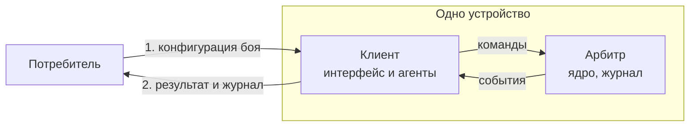
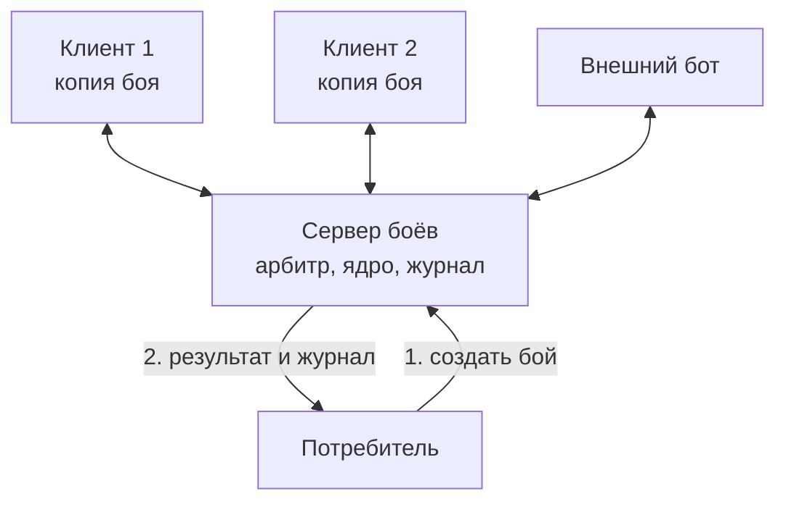

# Обзор архитектуры

Для тех, кто разрабатывает движок или встраивает его в своё приложение.

Обновлено 9 октября 2026.

## Коротко

Мы делаем движок пошаговых тактических боёв на поле из клеток: гексов, квадратов или объёмном поле с высотами. Существа, предметы, эффекты, правила и сценарии хранятся в JSON. Ядро считает бой по этим данным и всегда приходит к одному и тому же результату. О сети, хранилище, экране и о том, кто отправляет команды, ядро не знает.

С боем работают акторы: люди через интерфейс, ИИ, внешние боты. Для движка все они одинаковы, а что кому можно и что кому видно, решает отдельная политика доступа. Привычные роли — это готовые наборы прав в ней: «ведущий», «командующий» и «наблюдатель».

Движок — это набор библиотек и адаптеров, из которых собираются разные конфигурации. Основные варианты запуска такие:

| Вариант | Как работает | Когда подходит |
|---|---|---|
| Отдельно в браузере | Клиент сам принимает команды, ведёт журнал и хранит бой на устройстве. Сервер не нужен | Все акторы работают с одного устройства |
| С сервером | Сервер принимает команды и рассылает обновления, а у клиентов на устройствах акторов хранятся копии боя | Акторы работают с разных устройств |
| Внутри другой системы | Внешняя система, или потребитель, использует бой через контракт интеграции: создаёт бой по своей конфигурации и после боя получает результат и журнал. Связь с потребителем берёт на себя адаптер интеграции, а при прямом подключении адаптер не нужен. Работает как без сервера, так и с ним | Бой — часть другого продукта, в том числе нашей собственной игры |

Интеграция не привязана к одному способу. Контракт интеграции состоит из входящих портов и опубликованных форматов конфигурации, результата и журнала. Он один для всех, а способ связи реализует адаптер интеграции. Потребитель может подключить библиотеки движка напрямую, без адаптера, и тогда бой — просто часть его приложения. Может открыть наш клиент в iframe, обратиться к серверу по HTTP или написать собственный адаптер под свой стек. Ни контракт, ни ядро от этого не меняются.

Например, наша собственная тактическая игра в духе Героев меча и магии подключает библиотеки движка напрямую, и бой становится одним из её экранов. А сервис настольной ролевой игры на другом стеке встраивает бой к себе через iframe и передаёт в него текущее состояние персонажей. Подробнее эти случаи разобраны в разделе [«Примеры»](#примеры).

## Где работает арбитр

Команды боя принимает арбитр: проверяет права и правила, выполняет команду ядром и ведёт журнал. Без сервера арбитр работает в клиенте, с сервером — на сервере.

Логика арбитра от этого не зависит. В обоих случаях это один и тот же код прикладной логики с тем же ядром. Клиент обращается к арбитру через порт `Arbiter`: локальный адаптер вызывает его в той же вкладке, удалённый передаёт команды на сервер по каналу. Если арбитр переезжает или меняется способ связи с ним, меняются только адаптеры, а не арбитр и не ядро.

Потребитель на схемах подключён к клиенту или к серверу, но каким способом — прямо, через iframe или по HTTP, — для арбитра неважно.

### Без сервера

Бой идёт на одном устройстве. Арбитр работает в том же клиенте, что и интерфейс, и связан с ним каналом в памяти.

### С сервером

Каждый актор работает со своего устройства, а арбитр — на сервере. Клиенты и внешние боты отправляют ему команды и получают события, а у клиентов хранятся копии боя, которые только применяют присланные события.

На схемах прямоугольник — программа или её часть, рамка — устройство. На стрелке подписано, что передаётся, цифры показывают порядок.

## Примеры

Движок не привязан к конкретной игре. Вот как он используется в двух разных случаях.

**Настольная ролевая игра, например DnD.** Потребителем выступает сервис кампании на своём стеке, и он подключает бой через адаптер iframe. Когда партия вступает в бой, сервис открывает наш клиент, выбирает сценарий и передаёт текущее здоровье и снаряжение персонажей. Мастер получает набор прав «ведущий»: ходит за врагов, вводит результаты настоящих кубиков, правит состояние и откатывает ошибки. Если у игроков свои устройства, каждый получает набор «командующий» для своего персонажа. После боя сервис забирает результат и обновляет персонажей.

**Тактическая игра в духе Героев меча и магии.** Потребителем выступает наша собственная игра с глобальной картой. Она подключает библиотеки движка напрямую, и бой — просто один из её экранов. Два человека играют за одним компьютером по очереди: оба получают набор «командующий», каждый для своей стороны, а ведущего нет совсем. В игре против компьютера второй стороной командует агент ИИ. В сетевой партии каждый играет со своего устройства, а зрители получают набор «наблюдатель». После боя игра списывает потери армий и продолжает партию на карте.

## Главные решения

| Решение | Что это даёт | ADR |
|---|---|---|
| Архитектура не привязана к языку: все границы описаны схемами JSON Schema, первая реализация на TypeScript, а разные реализации движка могут отличаться правилами | Любую часть можно написать на другом языке, а движок использовать из любой системы | [0001](../decisions/0001-language-independence.md) |
| Ядро и прикладная логика в центре, всё остальное подключается адаптерами, а расширения регистрируются в реестрах | Новое хранилище, транспорт, ИИ, рендерер или потребитель добавляются без правок ядра | [0002](../decisions/0002-ports-adapters-microkernel.md) |
| Ядро без побочных эффектов: случайные значения оно берёт из генератора в состоянии боя, а данные извне получает через запросы ввода | Одни и те же правила работают в браузере, на сервере, в ботах и тестах; бой всегда воспроизводится | [0003](../decisions/0003-deterministic-kernel.md) |
| История боя хранится как журнал событий | Бой можно пересмотреть по шагам, откатить и отдать потребителю | [0004](../decisions/0004-event-journal.md) |
| У боя один арбитр, по умолчанию в клиенте. Акторы для него безлики, а о правах решает внешняя политика доступа | Клиент работает без сети, сервер подключается без переделки клиента, а новые роли не трогают ядро | [0005](../decisions/0005-arbiter-and-access.md) |
| Контент хранится в JSON, а поведение собирается из готовых операций | Новых существ и предметы добавляют без программирования, и их можно проверить автоматически | [0006](../decisions/0006-content-and-rules-as-data.md) |
| Внешние системы работают с боем через один контракт интеграции, а потребитель подключает библиотеки напрямую или через сменный адаптер: iframe, HTTP или свой | Бой встраивается куда угодно, новые способы интеграции не требуют правок движка | [0008](../decisions/0008-integration-contract.md) |
| Сущности называются `пак:имя` с псевдонимами при переименовании, паки версионируются семантически, хеш контента записан в журнале | Обновление паков не ломает сценарии и сохранённые бои | [0010](../decisions/0010-content-naming-and-versions.md) |
| Библиотеки, адаптеры и паки публикуются в npm отдельными пакетами `@heroes2dgame/*` под лицензией PolyForm Noncommercial 1.0.0 | Потребитель подключает только нужное; некоммерческое использование бесплатно, коммерческое — по платной лицензии | [0011](../decisions/0011-packages-and-license.md) |

Остальные решения перечислены в [списке решений](../decisions/README.md).

## Как устроено описание архитектуры

Описание разложено по четырём папкам. Читать удобно сверху вниз: сначала основы, потом решение, а темы — по мере надобности.

### Основы: что строим и зачем

| Документ | О чём |
|---|---|
| [Цели](foundations/goals.md) | Главная цель, поддерживаемые механики, расширение без изменений, чего мы не делаем |
| [Окружение системы](foundations/context.md) | Граница движка, кто и что снаружи, внешние интерфейсы, блоки и среды выполнения, готовые сборки |
| [Требования к качеству](foundations/quality.md) | Главные качества по важности и ситуации, по которым проверяется каждое |

### Решение: как система устроена

| Документ | О чём |
|---|---|
| [Стратегия](solution/strategy.md) | Архитектурный стиль и главные идеи |
| [Структура](solution/structure.md) | Где что лежит, порты, реестры расширений, профили, как добавить новое |
| [Как части работают вместе](solution/runtime.md) | Типичные ситуации по шагам: запуск боя, ход ИИ, сетевой бой, откат и другие |
| [Развёртывание](solution/deployment.md) | Что поставляется, варианты развёртывания и что нужно от инфраструктуры |

### Темы: подробно о каждой части

| Документ | О чём |
|---|---|
| [Контент](topics/content.md) | Паки, наследование, порядок загрузки, проверка, переводы |
| [Имена и версии](topics/naming-and-versions.md) | Правила именования контента и расширений, версии и совместимость |
| [Правила](topics/rules.md) | Набор правил, атрибуты, модификаторы, теги, эффекты, операции, способности, предметы |
| [Расчёт боя](topics/simulation.md) | Состояние, команды и события, стек шагов, запросы ввода, случайные значения, порядок ходов |
| [Журнал боя](topics/journal.md) | Журнал, снимки, просмотр, откат, ответвления |
| [Акторы, арбитр и синхронизация](topics/actors-and-sync.md) | Политика доступа, арбитр и копии боя, версии, проекции, каналы, сетевая игра |
| [Экран](topics/presentation.md) | Проигрыватель событий, манифест оформления, рендереры |
| [Сценарии, поле и редактор](topics/scenarios-and-editor.md) | Поле, сценарии, триггеры, условия победы, редактор |
| [Интеграция с другими системами](topics/integration.md) | Контракт интеграции и адаптеры: прямое подключение, iframe, HTTP, свои |

### Риски

| Документ | О чём |
|---|---|
| [Риски](planning/risks.md) | Что может пойти не так и что мы с этим делаем |

Решения с обоснованием собраны в [списке решений](../decisions/README.md), термины — в [словаре](../glossary.md).
