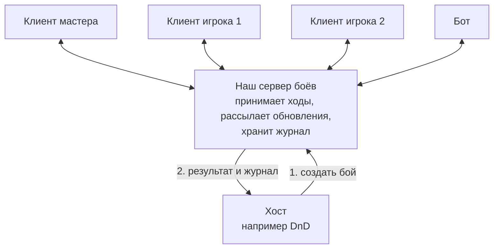

# Обзор архитектуры

Статус: целевая архитектура, черновик для обсуждения. Обновлено: 2026-10-03.
Для кого: все, кто разрабатывает движок или встраивает его в своё приложение.

## Кратко

Мы строим движок пошаговых тактических боёв на гексагональном поле в духе Heroes of Might and Magic III. Существа, предметы, эффекты, наборы правил и сценарии описываются данными. Ядро исполняет их детерминированно и ничего не знает о сети, хранилище и отрисовке.

Клиент самодостаточен. Он хранит состояние боя и полный журнал, умеет повторять и откатывать бой и работает без сервера. Так играет мастер, который ходит за всех и транслирует экран игрокам. Сервер подключается как отдельный адаптер, когда игроки, мастер и боты сидят на своих устройствах одновременно. Тогда источником истины становится сервер.

Внешние приложения, например DnD, открывают наш клиент в iframe, выбирают наш сценарий, передают параметры участников и в конце получают результат и журнал.

## Схема

Система работает в двух режимах. Разница только в том, где находится источник истины.

### Режим 1. Без сервера

Всё происходит на одном устройстве. Мастер ходит за все стороны и транслирует экран игрокам.

### Режим 2. С сервером

Каждый участник сидит на своём устройстве. Сервер принимает ходы и рассылает всем обновления.

Как читать: прямоугольник — программа, жёлтая рамка — устройство, подпись на стрелке — что передаётся, цифры — порядок.

## Главные решения

| Решение | Зачем | ADR |
|---|---|---|
| Гексагональная архитектура с микроядром: ядро и приложение в центре, всё внешнее подключается адаптерами, расширения регистрируются в реестрах | Новое хранилище, транспорт, ИИ, отрисовщик или хост добавляются без изменения ядра | [0002](../decisions/0002-hexagonal-microkernel.md) |
| Чистое детерминированное ядро | Один код правил в браузере, на сервере, в ботах и тестах; воспроизводимость | [0003](../decisions/0003-pure-deterministic-kernel.md) |
| Журнал событий как основа истории боя | Повтор по шагам, откат, аудит, передача хосту | [0004](../decisions/0004-event-journal.md) |
| Один источник истины на бой: локальный по умолчанию, серверный по желанию | Клиент работает автономно, сервер подключается без переделки | [0005](../decisions/0005-movable-single-authority.md) |
| Контент описывается данными, поведение — операциями из реестра | Новые существа и предметы без кода, проверяемые данные | [0008](../decisions/0008-content-as-data.md) |
| Встраивание через iframe и опубликованный протокол сообщений | Хост не зависит от нашего кода и наоборот | [0014](../decisions/0014-iframe-embedding.md) |

Полный список — в [журнале решений](../decisions/README.md).

## Содержание

| Файл | Раздел arc42 | О чём |
|---|---|---|
| [01-goals-and-constraints.md](01-goals-and-constraints.md) | 1, 2 | Цели, не-цели, заинтересованные стороны, цели качества, ограничения |
| [02-context.md](02-context.md) | 3 | Окружение системы, внешние участники и интерфейсы |
| [03-solution-strategy.md](03-solution-strategy.md) | 4 | Архитектурный стиль и ключевые идеи |
| [04-building-blocks.md](04-building-blocks.md) | 5 | Контейнеры, пакеты, порты, адаптеры, реестры, профили |
| [05-runtime.md](05-runtime.md) | 6 | Сценарии работы по шагам |
| [06-deployment.md](06-deployment.md) | 7 | Варианты развёртывания |
| [concepts/](concepts/README.md) | 8 | Сквозные концепции: контент, правила, симуляция, журнал, синхронизация, отображение, встраивание |
| [../decisions/](../decisions/README.md) | 9 | Архитектурные решения |
| [07-quality.md](07-quality.md) | 10 | Дерево качества и сценарии качества |
| [08-risks-and-open-questions.md](08-risks-and-open-questions.md) | 11 | Риски, технический долг, открытые вопросы |
| [09-roadmap.md](09-roadmap.md) | — | Этапы реализации |
| [../glossary.md](../glossary.md) | 12 | Словарь |
