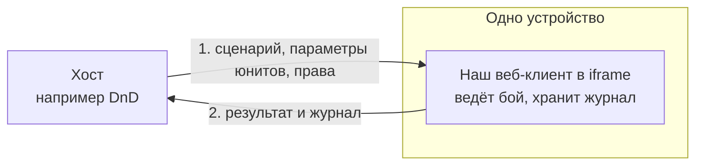
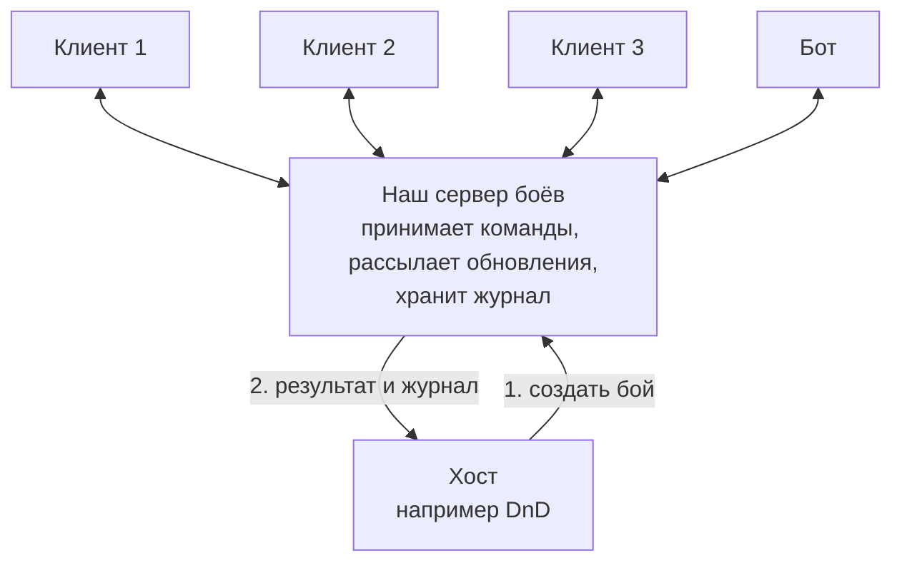

# Обзор архитектуры

Статус: черновик целевой архитектуры для обсуждения. Обновлено 5 октября 2026.
Для кого: для тех, кто разрабатывает движок или встраивает его в своё приложение.

## Коротко

Мы делаем движок пошаговых тактических боёв на поле из гексов, похожих на бои в Heroes of Might and Magic III. Существа, предметы, эффекты, правила и сценарии хранятся в JSON. Ядро считает бой по этим данным и всегда приходит к одному и тому же результату. О сети, хранилище, экране и о том, кто отправляет команды, ядро не знает.

С боем работают акторы: люди через интерфейс, ИИ, внешние боты. Для движка все они одинаковы, а что кому можно и что кому видно, решает отдельная политика доступа. Роли вроде мастера и игрока в DnD — это просто готовые наборы прав в ней: «ведущий» и «командующий».

Клиенту сервер не нужен. Он сам принимает команды, хранит бой и полный журнал, умеет показать любую запись журнала и откатиться к ней. Так удобно, когда один человек ходит за всех и показывает экран остальным. Если же акторы работают со своих устройств, подключается сервер, и команды принимает уже он.

Чужое приложение, например DnD, открывает наш клиент внутри iframe. Оно выбирает один из наших сценариев, передаёт параметры юнитов и права акторов, а после боя получает результат и журнал.

## Два режима работы

Режимы отличаются тем, где работает арбитр, то есть кто принимает команды. Без сервера это клиент, с сервером — сервер.

### Без сервера

Бой идёт на одном устройстве. Обычно один человек ходит за все стороны, а остальные смотрят его экран.

### С сервером

Каждый актор работает со своего устройства. Сервер принимает команды и рассылает всем обновления.

Прямоугольник на схемах — программа, жёлтая рамка — устройство. На стрелке подписано, что передаётся, цифры показывают порядок.

## Главные решения

| Решение | Что это даёт | ADR |
|---|---|---|
| Ядро и прикладная логика в центре, всё остальное подключается адаптерами, а расширения регистрируются в реестрах | Новое хранилище, транспорт, ИИ, рендерер или хост добавляются без правок ядра | [0001](../decisions/0001-ports-adapters-microkernel.md) |
| Ядро без побочных эффектов и случайности; данные извне оно получает через запросы ввода | Одни и те же правила работают в браузере, на сервере, в ботах и тестах; бой всегда воспроизводится | [0002](../decisions/0002-deterministic-kernel.md) |
| История боя хранится как журнал событий | Бой можно пересмотреть по шагам, откатить и отдать хосту | [0003](../decisions/0003-event-journal.md) |
| У боя один арбитр, по умолчанию в клиенте. Акторы для него безлики, а права решает внешняя политика доступа | Клиент работает без сети, сервер подключается без переделки клиента, а новые роли не трогают ядро | [0004](../decisions/0004-arbiter-and-access.md) |
| Контент хранится в JSON, а поведение собирается из готовых операций | Новых существ и предметы добавляют без программирования, и их можно проверить автоматически | [0005](../decisions/0005-content-and-rules-as-data.md) |
| Хост встраивает нас через iframe и общается опубликованными сообщениями | Хост не зависит от нашего кода, а мы от его | [0007](../decisions/0007-iframe-embedding.md) |

Остальные решения перечислены в [журнале решений](../decisions/README.md).

## Что ещё прочитать

| Файл | Раздел arc42 | О чём |
|---|---|---|
| [01-goals-and-constraints.md](01-goals-and-constraints.md) | 1, 2 | Цели и не-цели, кому что важно, главные качества, ограничения |
| [02-context.md](02-context.md) | 3 | Кто и что окружает систему, внешние интерфейсы |
| [03-solution-strategy.md](03-solution-strategy.md) | 4 | Архитектурный стиль и основные идеи |
| [04-building-blocks.md](04-building-blocks.md) | 5 | Приложения, пакеты, порты, адаптеры, реестры, профили |
| [05-runtime.md](05-runtime.md) | 6 | Как части работают вместе, по шагам |
| [06-deployment.md](06-deployment.md) | 7 | Как и где всё развёрнуто |
| [concepts/](concepts/README.md) | 8 | Контент, правила, расчёт боя, журнал, синхронизация, экран, встраивание |
| [../decisions/](../decisions/README.md) | 9 | Архитектурные решения |
| [07-quality.md](07-quality.md) | 10 | Требования к качеству и как их проверить |
| [08-risks-and-open-questions.md](08-risks-and-open-questions.md) | 11 | Риски и открытые вопросы |
| [09-roadmap.md](09-roadmap.md) | — | Этапы работы |
| [../glossary.md](../glossary.md) | 12 | Словарь |
