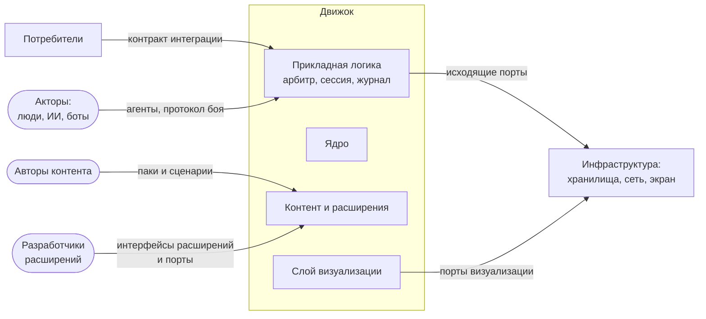

# Окружение системы

Где проходит граница движка, кто и что находится снаружи, через какие интерфейсы они взаимодействуют и в каких средах может работать каждый блок.

Обновлено 6 октября 2026.

Движок — это не одно приложение, а набор библиотек и адаптеров, из которых собираются разные конфигурации. Поэтому в этом документе граница проведена вокруг библиотек и адаптеров, а не вокруг конкретной сборки. Готовые сборки описаны в конце как примеры, а их устройство — в [структуре системы](../solution/structure.md).

## Граница системы

Внутри границы — библиотеки и адаптеры движка. Ядро считает бой по правилам. В прикладную логику входят арбитр, сессия боя, журнал и проекции. Слой визуализации показывает бой. Контент и стандартные расширения описывают правила, существ и механики. Адаптеры связывают всё это с конкретными технологиями.

Снаружи — все, кто пользуется движком или даёт ему что-то: потребители, акторы, авторы контента, разработчики расширений и инфраструктура.

Овал на схеме — человек, прямоугольник — система или модуль. Стрелка идёт от того, кто начинает взаимодействие. На ней подписано, через какую границу оно проходит.

## Кто и что снаружи

| Кто | Что ему нужно от движка | Через какую границу |
|---|---|---|
| Потребитель | Запустить бой со своими данными и получить результат и журнал | Контракт интеграции: напрямую или через адаптер — iframe, HTTP или свой |
| Актор | Отправлять команды и видеть бой в пределах своей области видимости | Агент, который действует от его имени, и протокол боя |
| Автор контента | Описывать существ, предметы, эффекты, правила и сценарии без программирования | Формат паков и сценариев, редактор |
| Разработчик расширений | Добавлять механики, агентов, политики доступа, рендереры, способы хранения, связи и интеграции | Интерфейсы расширений ядра и порты прикладной логики и визуализации |
| Инфраструктура | Хранить журналы, передавать сообщения, рисовать бой, давать время и зерно генератора | Исходящие порты: `JournalStore`, `Channel`, `Renderer`, `Clock`, `Entropy` и другие |

Актор — это участник боя, а не конкретный человек или программа. Решения за него принимает агент: интерфейс человека, ИИ или внешний бот. Какие права есть у актора, решает политика доступа. Подробнее — в описании [акторов и синхронизации](../topics/actors-and-sync.md).

## Внешние интерфейсы

| Интерфейс | Кто по ту сторону | Что передаётся | Где описан |
|---|---|---|---|
| Контракт интеграции | Потребители | Создание и продолжение боя, этапы жизни боя, результат, журнал; для потребителей со своим интерфейсом ещё команды и проекции | [Интеграция](../topics/integration.md) |
| Протокол боя | Агенты акторов, клиенты и внешние боты, если арбитр работает удалённо | Команды, ответы на них, пакеты событий, проекции, догрузка пропущенного | [Акторы и синхронизация](../topics/actors-and-sync.md) |
| Формат паков и сценариев | Авторы контента и редактор | JSON по опубликованным схемам | [Контент](../topics/content.md), [сценарии](../topics/scenarios-and-editor.md) |
| Интерфейсы расширений ядра | Разработчики механик | Операции, условия, порядок ходов и другие варианты механик | [Правила](../topics/rules.md) |
| Порты | Разработчики адаптеров | Хранение, связь, агенты, политика доступа, отрисовка, загрузка контента и оформления | [Структура системы](../solution/structure.md) |

Конкретные способы связи, например сообщения iframe и HTTP API сервера, — это адаптеры поверх контракта интеграции и протокола боя. Они описаны в документе об [интеграции](../topics/integration.md).

## Блоки и среды выполнения

Среда выполнения — это место, где исполняется код. Для реализации на TypeScript это браузер, Web Worker или Node.js. Большинство блоков движка не зависят от среды, поэтому одну и ту же логику можно запускать там, где удобно. Клиентов, ботов, потребителей и всё остальное, что общается с движком по протоколу боя или контракту интеграции, можно написать на любом языке.

| Блок | Браузер | Web Worker | Node.js | Замечания |
|---|---|---|---|---|
| Ядро и стандартные расширения | да | да | да | Чистый код без обращений к среде |
| Прикладная логика: арбитр, сессия, журнал, проекции | да | да | да | Где работает арбитр, решает профиль сборки |
| Агенты ИИ | да | да | да | В браузере обычно работают в Web Worker, чтобы не замедлять интерфейс |
| Слой визуализации и интерфейс | да | нет | только пустой рендерер | Пустой рендерер нужен для тестов и симуляций |
| Редактор | да | нет | нет | |
| Адаптеры | зависит от технологии | зависит от технологии | зависит от технологии | IndexedDB работает в браузере, база данных сервера и WebSocket-сервер — в Node.js, канал в памяти — везде |

Все эти блоки могут работать и внутри приложения потребителя, если тот подключает библиотеки движка напрямую.

## Готовые сборки

Из библиотек и адаптеров мы собираем четыре приложения. Это примеры конфигураций, а не граница системы: потребитель может собрать свою.

| Сборка | Среда | Что в ней |
|---|---|---|
| Веб-клиент | Браузер | Интерфейс, слой визуализации, арбитр для боя без сервера или копия боя для сетевого, просмотр записи |
| Сервер боёв | Node.js | Арбитр для сетевого боя, хранилище в базе данных, WebSocket, серверные агенты ИИ |
| Редактор | Браузер | Работа с паками и сценариями, пробный запуск боя |
| Симулятор | Node.js | Бои ИИ против ИИ без интерфейса для проверки баланса и воспроизводимости |

## Что остаётся снаружи

Всё, что происходит до и после боя, остаётся у потребителя: прогресс, персонажи, армии, сюжет. Движок получает от потребителя только то, что нужно для боя, и возвращает результат.

Учётные записи и вход пользователей тоже на стороне потребителя.

Если бой идёт на одном устройстве, участникам, у которых нет доступа к нему, экран показывают сторонними средствами: видеозвонком или проектором.
