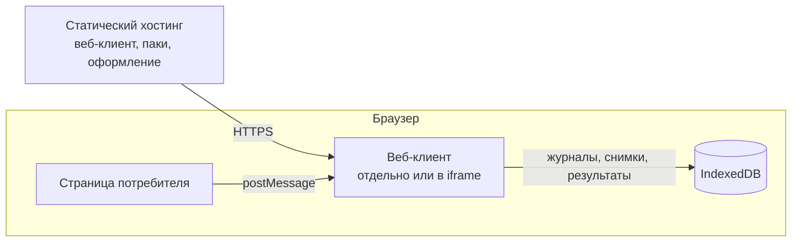
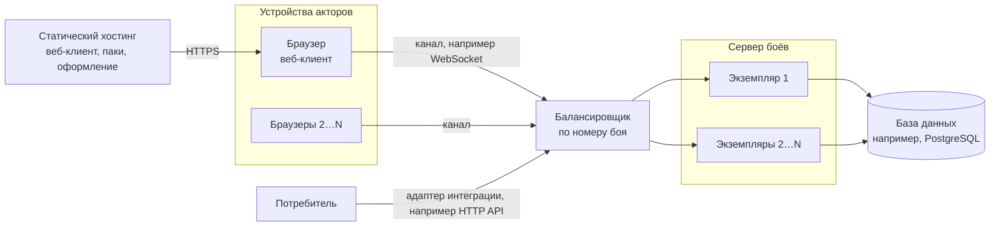

# Развёртывание

Что из движка поставляется, куда это устанавливается и что для этого нужно от инфраструктуры.

Обновлено 6 октября 2026.

Схема развёртывания зависит от конфигурации. Ниже описаны варианты для наших приложений. Их можно сочетать, а потребитель может развернуть бой по-своему из тех же библиотек и адаптеров.

## Что поставляется

| Что | В каком виде | Кому нужно |
|---|---|---|
| Библиотеки и адаптеры | Пакеты npm | Потребителю, который собирает бой в своём приложении |
| Веб-клиент | Статические файлы | Для боя в браузере, отдельно или внутри iframe, и для просмотра записи |
| Сервер боёв | Приложение на Node.js | Для сетевых боёв |
| Паки контента | Файлы JSON | Клиенту и серверу. Встраиваются в сборку или загружаются по HTTP |
| Оформление | Манифест оформления, картинки, звуки | Клиенту. Встраивается в сборку или загружается по HTTP |
| Редактор | Статические файлы | Авторам контента |
| Симулятор | Приложение на Node.js для командной строки | Авторам контента и разработчикам: бои ИИ против ИИ для проверки баланса и воспроизводимости |

## Внутри приложения потребителя

Потребитель подключает библиотеки и адаптеры как пакеты и собирает бой в своём приложении. Отдельно разворачивать ничего не нужно: бой поставляется вместе с приложением потребителя и хранит данные там, куда указывает выбранный адаптер хранилища.

## Веб-клиент без сервера

Веб-клиент — набор статических файлов, для него нужен только статический хостинг с HTTPS. Паки и оформление размещаются рядом с клиентом или на отдельном адресе. Всё, что относится к бою, хранится в IndexedDB на устройстве.

Если потребитель открывает клиент в iframe, хостинг добавляет к ответам заголовок `Content-Security-Policy: frame-ancestors` со списком потребителей, которым это разрешено. Если клиент открыт отдельно, страницы потребителя на схеме нет.

## С сервером

Сервер боёв отвечает потребителям через адаптер интеграции, например HTTP API, и держит связь с клиентами акторов через адаптер канала, например WebSocket. Он же запускает серверных агентов ИИ. В базе данных хранятся бои, журналы, снимки, результаты и таблицы прав.

Каждый экземпляр сервера ведёт сколько угодно боёв одновременно, а экземпляров может быть сколько угодно. От инфраструктуры для этого нужно:

- балансировщик, который направляет все запросы и соединения одного боя в один экземпляр по номеру боя;
- поддержка долгих соединений, если выбранный канал их использует, например WebSocket;
- одна база данных на все экземпляры, с транзакциями и уникальными ключами. Подойдёт, например, PostgreSQL, а конкретную базу выбирает адаптер хранилища.

При первом обращении к бою экземпляр поднимает арбитра: берёт последний снимок и записи журнала после него. Если экземпляр остановился, бой поднимает тот экземпляр, куда балансировщик направит следующее обращение. Почему два экземпляра не могут вести один бой одновременно, описано в [акторах и синхронизации](../topics/actors-and-sync.md#эпоха).

Код сервера не зависит от облачного провайдера. Сервер можно написать и на другом языке, если он работает по тому же протоколу. Подробнее — в ADR [0009](../../decisions/0009-battle-server.md).
