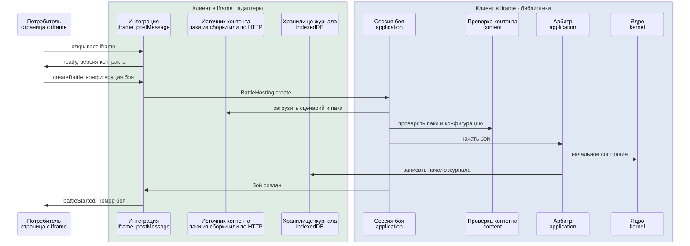
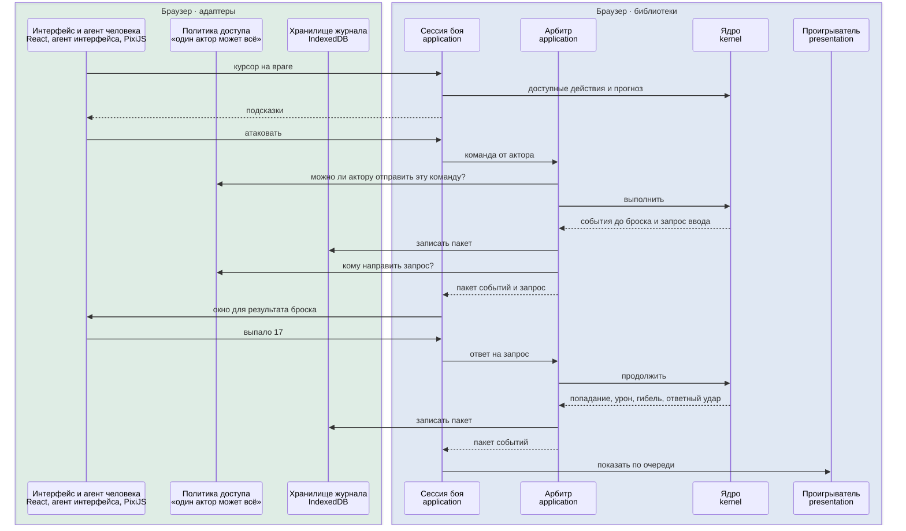
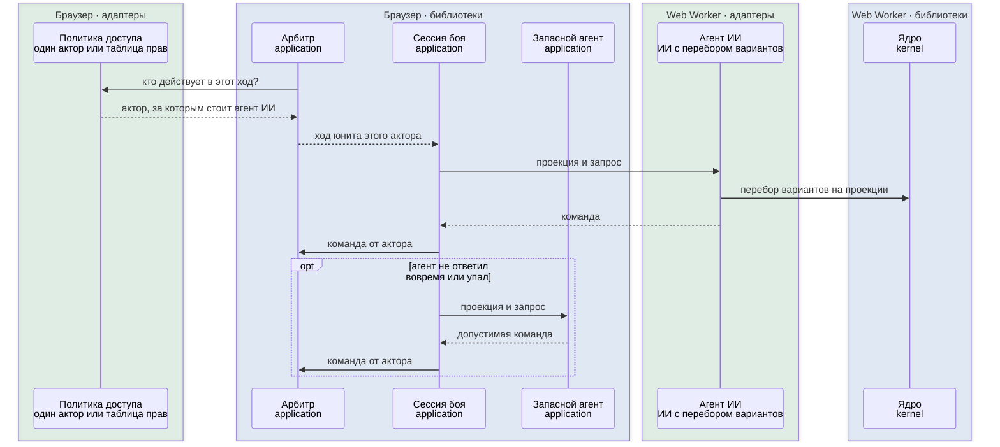
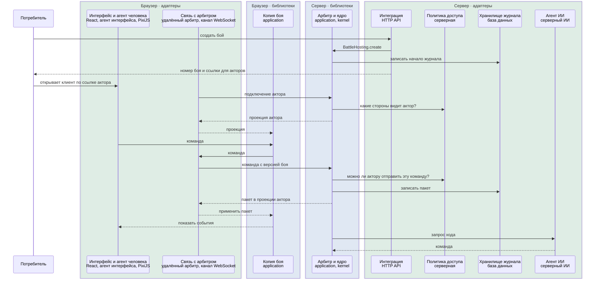
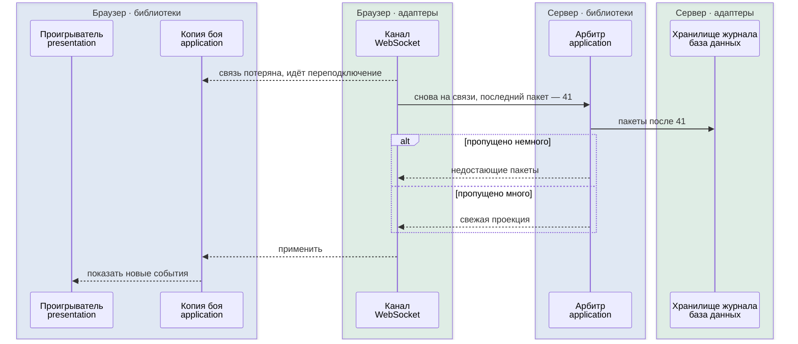
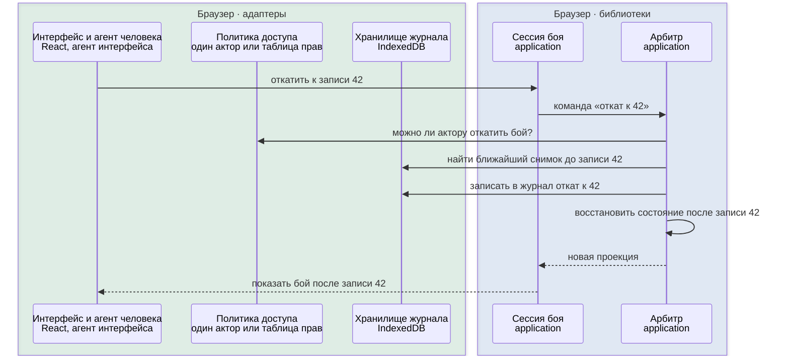
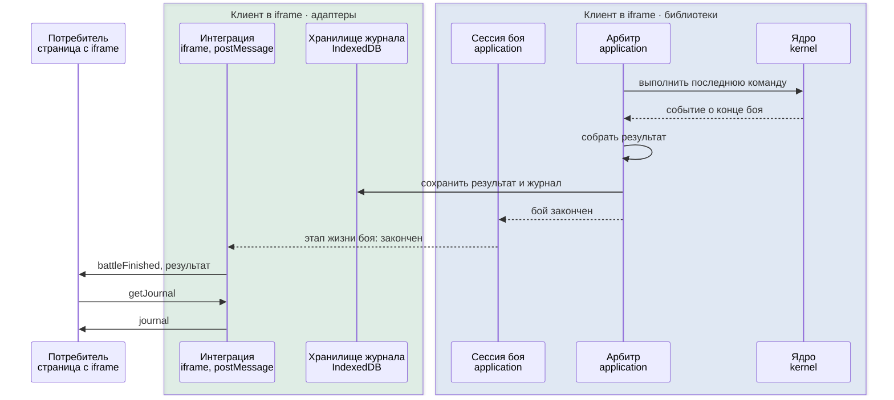

# Как части работают вместе

Как части системы взаимодействуют в семи типичных ситуациях и какие из этих частей общие для всех конфигураций, а какие зависят от сборки.

Обновлено 6 октября 2026.

Во всех сценариях работают одни и те же библиотеки: ядро и прикладная логика. От конфигурации зависят только адаптеры: где работает арбитр, какая подключена политика доступа, где хранится журнал, какие агенты действуют от имени акторов и как бой связан с потребителем. Ядро ни в одном сценарии не знает, кто отправил команду.

Конфигурации в сценариях — это примеры наших приложений, а не единственно возможные сборки. Библиотеки и готовые адаптеры можно подключать в своих проектах и сочетать как угодно: заменить любой адаптер своим, добавить новый или собрать конфигурацию, которой здесь нет. Шаги в сценариях от этого не меняются, меняются только участники в зелёных рамках.

## Кто участвует

| Участник | Где лежит | Готовые реализации |
|---|---|---|
| Ядро | Библиотека `kernel` | Одна для всех конфигураций |
| Сессия боя, арбитр, копия боя, запасной агент, просмотр и откат | Библиотека `application` | Одна для всех конфигураций |
| Проверка контента | Библиотека `content` | Одна для всех конфигураций |
| Проигрыватель | Библиотека `presentation` | Одна для всех конфигураций |
| Интерфейс | Выбирает приложение | React в браузере |
| Рендерер | Адаптер | PixiJS и SVG в браузере, пустой рендерер в тестах |
| Источник контента | Адаптер | Паки, встроенные в сборку; загрузка по HTTP |
| Политика доступа | Адаптер | «Один актор может всё»; по таблице прав из конфигурации; серверная |
| Хранилище журнала | Адаптер | IndexedDB в браузере; база данных на сервере, например PostgreSQL; в памяти для тестов |
| Агенты | Адаптер | Интерфейс человека в браузере; ИИ в Web Worker браузера или на сервере; языковая модель; внешний бот через канал |
| Арбитр | Адаптер | Локальный: арбитр работает в том же клиенте; удалённый: команды уходят на сервер |
| Канал | Адаптер | В памяти внутри вкладки; WebSocket между клиентом и сервером; BroadcastChannel между вкладками браузера |
| Связь с потребителем | Адаптер интеграции | iframe с `postMessage` в браузере; HTTP API на сервере; автономный запуск. При прямом подключении адаптера нет |
| Сервер боёв | Приложение | Node.js: те же библиотеки с серверными адаптерами |

На схемах рамка показывает две вещи: где работает код (браузер, Web Worker или сервер) и что в ней — общие библиотеки или адаптеры конкретной сборки. Синие рамки — библиотеки, одинаковые во всех конфигурациях. Зелёные — адаптеры, которые выбирает сборка. Вторая строка у участника — имя библиотеки или конкретная технология адаптера.

## Потребитель запускает бой через iframe без сервера

Это один из способов интеграции. Остальные устроены так же, меняется только адаптер интеграции: при прямом подключении потребитель вызывает `BattleHosting.create` сам.

Пример конфигурации: профиль `iframe`; адаптеры — интеграция через iframe, локальный арбитр, политика доступа по таблице прав, хранилище IndexedDB, паки из сборки или по HTTP.

1. Потребитель открывает iframe по адресу встраивания, и клиент запускается в профиле `iframe`.
2. Адаптер интеграции проверяет, что страница-родитель есть в списке разрешённых, и отправляет `ready` с версией контракта.
3. Потребитель присылает `createBattle`. В нём имя нашего сценария, параметры юнитов (например, сколько здоровья у юнита осталось после прошлого боя), список акторов с правами и агентами, а также настройки экрана.
4. Адаптер вызывает `BattleHosting.create`. Дальше всё происходит в библиотеках. Сессия загружает сценарий и паки через источник контента и проверяет их вместе с конфигурацией. Если что-то не так, потребитель получает список ошибок, и бой не создаётся.
5. Сессия создаёт политику доступа по таблице прав из конфигурации. Арбитр через ядро строит начальное состояние: берёт юниты из сценария и применяет к ним параметры из конфигурации.
6. Арбитр записывает в IndexedDB заголовок журнала: паки с версиями, хеш контента, версии движка, конфигурацию и зерно генератора, если в правилах есть случайность. Полный состав заголовка — в описании [журнала](../topics/journal.md).
7. Потребитель получает `battleStarted` с номером боя. Если страница перезагрузится, бой продолжится из IndexedDB по этому номеру.

## Бросок вводится вручную

Один актор ведёт бой за все стороны, а броски атаки по набору правил вводятся извне. Например, человек бросает настоящие кубики.

Пример конфигурации: профиль `solo`; адаптеры — локальный арбитр, политика «один актор может всё», агент интерфейса, хранилище IndexedDB, рендерер PixiJS.

1. Пока человек водит курсором, интерфейс спрашивает подсказки у сессии через порт `BattlePlay`. Сессия считает их ядром, а интерфейс сам решает, как подсветить варианты. Состояние боя при этом не меняется.
2. Человек выбирает атаку, и агент интерфейса отправляет команду от имени своего актора.
3. Арбитр спрашивает политику доступа, можно ли этому актору отправить команду для этого юнита. Политика «один актор может всё» отвечает «можно».
4. Ядро проверяет, что атака допустима по правилам, и раскладывает её на шаги: пройти путь, ударить, получить ответный удар, пересчитать ауры, проверить погибших, закончить ход юнита. Полный список шагов — в описании [расчёта боя](../topics/simulation.md#стек-шагов).
5. Ядро доходит до броска атаки. По набору правил этот бросок приходит извне, поэтому ядро записывает запрос ввода и останавливается.
6. Арбитр записывает пакет в журнал и спрашивает политику, кому направить запрос. Политика называет того же актора, и у него открывается окно ввода. Человек вводит 17.
7. Ответ приходит обычной командой, и ядро продолжает с того же шага: попадание, урон, гибель части отряда, ответный удар. Бросок для ответного удара по набору правил берётся из генератора, поэтому ядро бросает его само, без запроса.
8. Проигрыватель показывает события по очереди, и экран постепенно приходит к текущему состоянию боя.

## Ходит ИИ

Пример конфигурации: профиль `solo` или `iframe`; адаптеры — агент ИИ в Web Worker, политика доступа «один актор может всё» или по таблице прав. На сервере тот же сценарий выполняет серверный агент ИИ.

1. После очередного пакета арбитр спрашивает политику доступа, кто действует в этот ход. Политика называет актора, от имени которого действует агент ИИ.
2. Сессия отправляет агенту проекцию в пределах области видимости его актора. Скрытое от актора агент не получает.
3. Агент работает в Web Worker, чтобы не замедлять интерфейс. Он перебирает варианты, вызывая собственный экземпляр библиотеки ядра на своей проекции. Проекцию при этом он не меняет.
4. Агент возвращает команду, и она проходит ту же проверку, что и любая другая.
5. Если агент не уложился в отведённое время или упал, за него отвечает запасной агент из прикладной логики: он выбирает один из допустимых вариантов по своим правилам. Ядро в этом не участвует. Запасной агент и отсчёт времени работают там же, где арбитр, поэтому в сетевом бою — на сервере.

## Сетевой бой

Акторы работают со своих устройств, а арбитр — на сервере.

Пример конфигурации клиента: профиль `networked`; адаптеры — удалённый арбитр, канал WebSocket, агент интерфейса, IndexedDB как кэш копии боя, рендерер PixiJS. Пример конфигурации сервера: профиль `server`; те же библиотеки `kernel` и `application` и адаптеры — локальный арбитр, серверная политика доступа, хранилище в базе данных, канал WebSocket, интеграция через HTTP API, серверный агент ИИ.

На схеме показан один клиент. У каждого актора свой клиент, и все они работают одинаково.

1. Потребитель создаёт бой через HTTP API сервера, передаёт таблицу прав и получает по ссылке на каждого актора.
2. Каждый актор открывает свою ссылку. Клиент запускается в профиле `networked` и подключается к серверу по каналу, в этом примере по WebSocket.
3. Сервер определяет, какой актор подключился, и отправляет каждому проекцию в пределах его области видимости. Актору с полной видимостью достаётся весь бой.
4. Актор отправляет команду. Сервер сверяет версию боя, спрашивает политику доступа, выполняет команду ядром и записывает пакет в базу данных. Как арбитр обрабатывает команды, описано в [акторах и синхронизации](../topics/actors-and-sync.md#арбитр-и-копии-боя).
5. Сервер рассылает пакет всем клиентам, причём каждому в его проекции.
6. Если дальше ходит юнит, за который отвечает серверный агент ИИ, сервер сам запрашивает у агента команду. Внешний бот подключается так же, как обычный клиент.
7. В клиентах работает копия боя из той же библиотеки `application`. Она только применяет полученные события и правила заново не считает. Поэтому генератор случайных чисел и скрытая часть состояния остаются на сервере.

## Связь пропала и вернулась

Переподключение — забота адаптера канала, а копия боя и проигрыватель работают так же, как всегда.

1. Клиент теряет связь. Канал переходит в состояние переподключения, и интерфейс это показывает.
2. Когда связь возвращается, клиент сообщает номер последнего полученного пакета.
3. Сервер присылает недостающие пакеты. Если их слишком много, сервер присылает свежую проекцию.
4. Копия боя применяет полученное. Если пришла свежая проекция, проигрыватель восстанавливает из состояния постоянные элементы вроде аур и иконок эффектов. Показываются только новые события.
5. Если клиент отправил команду, а ответ потерялся, он отправляет её ещё раз с тем же идентификатором и получает тот же ответ.

## Просмотр и откат

Просмотр и откат целиком реализованы в библиотеке `application`. На схеме бой без сервера. В сетевом бою те же шаги выполняет сервер с хранилищем в базе данных, а клиенты получают новую проекцию по своему каналу.

1. Актор открывает журнал боя и выбирает запись. В режиме просмотра журнал можно листать вперёд и назад. Состояние после каждой записи собирается из ближайшего снимка и последующих событий, а правила заново не считаются. Просмотр ничего не меняет, поэтому арбитр в нём не участвует. В сетевом бою нужные записи клиент запрашивает у сервера через порт `BattleHistory`.
2. Чтобы продолжить бой с выбранной записи, актор отправляет команду сессии «откат».
3. Арбитр спрашивает политику доступа, можно ли этому актору откатить бой. Откат меняет историю для всех, поэтому обычно его разрешают только актору с полными правами.
4. Арбитр записывает откат в журнал и только после этого восстанавливает состояние после выбранной записи. Записи после неё не удаляются: они остаются в журнале отменённой веткой, и их можно посмотреть.
5. Вместе с состоянием восстанавливается генератор случайных чисел. Поэтому те же действия после отката дадут те же броски.
6. Все копии боя получают новую проекцию.

## Бой заканчивается

На схеме бой без сервера с потребителем, подключённым через iframe. Остальные варианты перечислены в шагах.

1. Ядро проверяет условия победы и поражения в конце каждой команды и в начале каждого раунда, после триггеров сценария. Когда одно из них выполнено, ядро выпускает событие о конце боя с исходом и хешем состояния и снимает открытый запрос ввода, если он был.
2. Арбитр собирает результат боя: исход, что стало с каждым юнитом, потери, сколько потрачено предметов и способностей, значения переменных сценария.
3. Арбитр сохраняет результат и полный журнал в хранилище, которое выбрала конфигурация, например в IndexedDB в браузере или в базе данных на сервере.
4. Потребитель узнаёт о конце боя и получает результат. При прямом подключении это событие подписки `BattleHosting`, через iframe — сообщение `battleFinished`, через сервер — ответ HTTP API. Журнал может быть большим, поэтому потребитель запрашивает его отдельно.
5. Что делать с результатом, потребитель решает сам.
